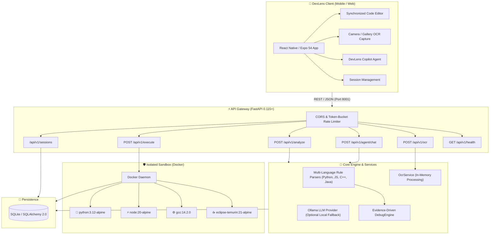

<div align="center">

# 🔍 DevLens

### *The Intelligent On-the-Go Code Debugger & Zero-Trust Sandbox*

[](https://fastapi.tiangolo.com)
[](https://reactnative.dev)
[](https://www.typescriptlang.org/)
[](https://www.docker.com)
[](https://python.org)
[](LICENSE)

<p align="center">
  <b>DevLens</b> empowers software engineers to analyze, explain, fix, and safely execute code right from their mobile device or workstation with sub-second feedback, camera OCR code capture, and isolated container sandboxing.
</p>

[🌟 Key Features](#-key-features) •
[🏗️ System Architecture](#️-system-architecture) •
[🚀 Quick Start](#-quick-start) •
[🛡️ Security & Sandboxing](#️-security--sandboxing) •
[📡 API Reference](#-api-reference) •
[📱 Mobile & APK Setup](#-android-apk--mobile-setup) •
[📚 Documentation Hub](#-documentation-hub)

---

</div>

## 🌟 Key Features

<table>
  <tr>
    <td width="50%">
      <h3>🧠 Instant Code Diagnostics</h3>
      Heuristic static analysis engine with multi-language rule parsers. Detects syntax errors, edge cases, off-by-one errors, infinite loops, and unhandled exceptions across <b>Python, JavaScript, C++, and Java</b>.
    </td>
    <td width="50%">
      <h3>🛡️ Zero-Trust Docker Sandbox</h3>
      Safely execute untrusted code in an ephemeral container. Hardened with <b>no network access</b>, <b>read-only filesystem</b>, <b>dropped capabilities</b>, <b>256MB RAM limit</b>, and automatic orphan container cleanup.
    </td>
  </tr>
  <tr>
    <td width="50%">
      <h3>📷 Camera & Gallery OCR</h3>
      Photograph code off screens or physical printouts, extract clean text in-memory, auto-detect the programming language, and preview with an interactive confidence-scored modal before editor insertion.
    </td>
    <td width="50%">
      <h3>🤖 Interactive AI Copilot Agent</h3>
      Ask natural language questions, receive algorithmic optimizations, generate unit test suites, and apply one-tap diff repairs powered by local Ollama LLMs with deterministic heuristic fallbacks.
    </td>
  </tr>
  <tr>
    <td width="50%">
      <h3>📱 Cross-Platform UI (Mobile & Web)</h3>
      Built on <b>Expo & React Native</b> for Android, iOS, and Web browsers. Features synchronized line numbering, error gutter indicators, tab navigation, and smooth one-tap bug repair diff views.
    </td>
    <td width="50%">
      <h3>⚡ Resilient Backend API</h3>
      Engineered on <b>FastAPI & SQLAlchemy 2.0</b> with asynchronous event loops, optimized <code>selectinload</code> queries preventing $N+1$ overhead, and token-bucket client rate limiting.
    </td>
  </tr>
</table>

---

## 🏗️ System Architecture



---

## 📂 Project Structure

```text
devlens/
├── 🐍 backend/                      # FastAPI Python Application
│   ├── app/
│   │   ├── api/routes/              # REST controllers (analyze, execute, ocr, sessions, agent)
│   │   ├── analysis/                # Core diagnostic pipeline & rule engines
│   │   ├── analyzers/               # Language AST & heuristic analyzers (Python, JS, C++, Java)
│   │   ├── execution/               # Docker container sandboxing manager
│   │   ├── models/                  # SQLAlchemy 2.0 ORM schemas
│   │   ├── schemas/                 # Pydantic v2 DTO request/response models
│   │   ├── services/                # OCR, session, and debugging services
│   │   └── utils/                   # Rate limiting, logger, and security helpers
│   ├── tests/                       # Pytest test suite (13 test modules)
│   └── requirements.txt             # Python dependencies
├── 📱 mobile/                       # React Native / Expo Application
│   ├── app/                         # Expo Router screens (index, new-session, history, settings)
│   ├── components/                  # CodeEditor, CameraScanModal, AgentCopilot, ErrorPanel
│   ├── hooks/                       # Custom network, session, and state hooks
│   ├── services/                    # Typed API client with 204 safe-deletion
│   └── package.json                 # Node dependencies & Expo config
├── 📚 docs/                         # In-depth architectural & developer documentation
│   ├── API.md                       # Comprehensive API specification & schemas
│   ├── ARCHITECTURE.md              # Subsystem design & sequence diagrams
│   ├── DEVELOPMENT.md               # Developer setup & contribution guide
│   ├── SECURITY.md                  # Security whitepaper & STRIDE threat model
│   ├── APK_CI_AND_INSTALLATION.md   # Android APK CI & physical phone guide
│   ├── FUTURE_FEATURES.md           # Engineering roadmap & future capabilities
│   └── OFFICE_KIT_INTEGRATION.md    # Workstation companion pairing spec
├── 🐳 docker-compose.yml            # Unified orchestration
└── 📄 README.md                     # Project overview & quick start
```

---

## 🚀 Quick Start

### 1️⃣ Backend Setup

> **Prerequisites:** Python 3.12+ (or 3.13) and [Docker Desktop](https://www.docker.com)

```bash
cd backend

# 1. Initialize environment configuration
cp .env.example .env

# 2. Setup virtual environment
# Linux / macOS:
python3 -m venv .venv
source .venv/bin/activate

# Windows PowerShell:
python -m venv .venv
.\.venv\Scripts\Activate.ps1

# 3. Install dependencies
pip install -r requirements.txt

# 4. Launch FastAPI development server
uvicorn app.main:app --reload --host 0.0.0.0 --port 8001
```

* 📚 **Interactive Swagger API Docs:** [`http://localhost:8001/docs`](http://localhost:8001/docs)
* 💓 **Health & Sandbox Status:** [`http://localhost:8001/api/v1/health`](http://localhost:8001/api/v1/health)

---

### 2️⃣ Mobile / Web Client Setup

> **Prerequisites:** Node.js 20+ and [Expo Go](https://expo.dev/go) (or web browser)

```bash
cd mobile

# 1. Initialize environment configuration
cp .env.example .env

# 2. Install dependencies
npm install

# 3. Start Expo development server
npx expo start
```

* 🌐 **Web Browser:** Press `w` in the terminal to open [`http://localhost:8081`](http://localhost:8081).
* 📱 **Physical Android / iOS Device:** Scan the QR code using the **Expo Go** mobile app.
* 🔗 **Connecting Phone to Backend:** Set `EXPO_PUBLIC_API_URL=http://<YOUR_LAN_IP>:8001` in `mobile/.env` or run `adb reverse tcp:8001 tcp:8001` over USB.

---

## 🛡️ Security & Sandboxing

DevLens enforces a strict **Zero Host-Code Execution** policy. Untrusted code submitted by clients is never run directly on the host machine.

| Security Control | Configuration | Protection Objective |
| :--- | :--- | :--- |
| **Network Isolation** | `--network none` | Completely prevents outbound data exfiltration, reverse shells, and SSRF attacks. |
| **Filesystem Hardening** | `--read-only` | Root filesystem is immutable; code compiles strictly in a transient mount. |
| **Privilege Revocation** | `--cap-drop ALL` | Strips all 41+ Linux root capabilities. |
| **Anti-Escalation** | `--security-opt no-new-privs` | Prevents child processes from gaining elevated privileges via setuid/setgid binaries. |
| **Memory Capping** | `-m 256M --memory-swap 256M` | Enforces a strict hard limit on RAM usage and disables swap expansion. |
| **CPU Throttling** | `--cpus 0.5` | Restricts runaway loops from degrading host machine responsiveness. |
| **Process Limit** | `--pids-limit 64` | Completely neutralizes fork bombs and runaway thread generation. |
| **Hard Timeout** | `5 seconds` | Host watchdog terminates and prunes containers that exceed runtime limits. |

---

## 📡 API Reference

| Method | Endpoint | Description | Status Code |
| :---: | :--- | :--- | :---: |
| `POST` | `/api/v1/analyze` | Parse source code, detect bugs, and generate corrected solution | `201 Created` |
| `POST` | `/api/v1/execute` | Execute validated code in the secure Docker container | `200 OK` / `503` |
| `POST` | `/api/v1/debug` | Multi-stage evidence-driven debugging & complexity analysis | `200 OK` |
| `POST` | `/api/v1/ocr` | Extract source code and detect language from image in-memory | `200 OK` |
| `POST` | `/api/v1/agent/chat` | Chat with DevLens Copilot (AI assistant with heuristic fallback) | `200 OK` |
| `GET` | `/api/v1/sessions` | Fetch paginated debugging sessions (`?limit=50&offset=0`) | `200 OK` |
| `GET` | `/api/v1/sessions/{id}` | Retrieve comprehensive session details, diffs, and executions | `200 OK` |
| `DELETE` | `/api/v1/sessions/{id}` | Permanently remove a session and associated execution logs | `204 No Content` |
| `GET` | `/api/v1/health` | Query API health and Docker sandbox availability | `200 OK` |

*👉 For complete request/response schemas and code examples, see [docs/API.md](docs/API.md).*

---

## 📱 Android APK & Mobile Setup

DevLens includes an automated GitHub Actions CI pipeline that builds a standalone Android APK on every push:

* **Direct Phone Download:** Download `devlens-v0.1.0.apk` from [GitHub Releases](https://github.com/Bit-manipulators/DevLense/releases) directly on your Android phone.
* **USB Cable 1-Click Install:** Connect your Android phone with USB debugging enabled and run:
  ```powershell
  .\scripts\install-to-phone.ps1
  ```
* **Full Step-by-Step Guide:** See [docs/APK_CI_AND_INSTALLATION.md](docs/APK_CI_AND_INSTALLATION.md).

---

## 🧪 Testing

Comprehensive test suites ensure backend and mobile stability:

```bash
# 1. Run backend unit & integration tests
cd backend
python -m pytest -v

# 2. Run mobile unit tests and TypeScript check
cd ../mobile
npm test
npm run typecheck
```

---

## 📚 Documentation Hub

Explore the full documentation suite for deep architectural and operational details:

* 📡 [**API Reference & Specification**](docs/API.md) — Endpoint schemas, request/response bodies, error formats.
* 🏗️ [**System Architecture & Technical Design**](docs/ARCHITECTURE.md) — Subsystem breakdowns, sequence diagrams, and ER schemas.
* 🛠️ [**Developer & Contributor Guide**](docs/DEVELOPMENT.md) — Environment setup, analyzer creation tutorial, and best practices.
* 🛡️ [**Security Architecture & Threat Model**](docs/SECURITY.md) — Sandbox isolation controls, STRIDE analysis, and deployment checklist.
* 📱 [**Android APK CI & Installation Guide**](docs/APK_CI_AND_INSTALLATION.md) — Build automation, ADB installation, and device networking.
* 🚀 [**Future Roadmap & Technical Specs**](docs/FUTURE_FEATURES.md) — Distributed runners, Tree-sitter AST, and collaborative debugging.
* 🖥️ [**Office Kit & Workstation Integration**](docs/OFFICE_KIT_INTEGRATION.md) — Cryptographic pairing and remote workstation proxy.

---

<div align="center">

### Built with precision for developers who debug everywhere.

<sub>Released under the [MIT License](LICENSE). Copyright © 2026 DevLens Contributors.</sub>

</div>
