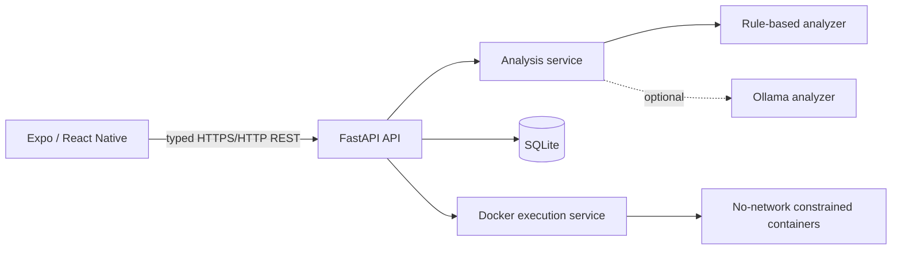

# DevLens

**AI Debugging Assistant in Your Pocket** is a mobile-first developer tool: paste code, add an error, get a structured diagnosis, apply a concrete correction, and validate it in a constrained Docker sandbox.

It is a working MVP, not a mockup. The Expo client calls the FastAPI backend; analysis sessions and execution results persist in SQLite. The default analyzer is deterministic and has no API-key requirement.

## Features

- Structured debugging analysis for Python, C++, JavaScript, and Java.
- Local rule-based analyzer with optional Ollama provider and automatic safe fallback.
- SQLite-backed session history with fetch and delete flows.
- Mobile Expo Router app with dashboard, editor, result, sandbox output, history, and settings screens.
- Docker-only execution for Python, C++, and JavaScript—there is no unsafe host-code fallback.
- Input/output limits, CORS, response headers, request rate-limit abstraction, and a documented threat model.

## Architecture



See [architecture details](docs/ARCHITECTURE.md), [API reference](docs/API.md), and the [security design](docs/SECURITY.md).

## Repository structure

```text
devlens/
├── backend/       FastAPI, SQLAlchemy, analyzers, Docker execution, pytest
├── mobile/        Expo Router React Native application and Jest tests
├── docs/          Architecture, API, security, and development documents
└── docker-compose.yml
```

## Backend setup

Requires Python 3.12+ (Python 3.13 also works for this MVP).

```powershell
cd backend
Copy-Item .env.example .env
python -m venv .venv
.\.venv\Scripts\Activate.ps1
pip install -r requirements.txt
uvicorn app.main:app --reload --host 0.0.0.0 --port 8001
```

Open `http://localhost:8001/docs` for live OpenAPI documentation and `http://localhost:8001/api/v1/health` for health status.

## Mobile setup

Requires Node.js 20+ and Expo Go on an Android device (or an Android emulator).

```powershell
cd mobile
Copy-Item .env.example .env
# Edit .env for a physical device: use your computer's LAN IP, e.g. http://192.168.x.x:8001
npm install
npx expo start
```

Then scan the QR code with Expo Go, or choose the Android emulator. **Do not use `localhost` in `EXPO_PUBLIC_API_URL` for a physical phone**—on the phone it refers to the phone itself. Keep the phone and computer on the same LAN and allow inbound port 8001 through the development firewall.

## Secure execution setup

Install and start Docker Desktop. DevLens checks this at execution time; if Docker is unavailable, `/execute` returns a clear `503` and the app displays the configuration problem. It never runs submitted code directly on the host.

The executor pulls these images on first use: `python:3.12-alpine`, `node:20-alpine`, and `gcc:14.2.0`.

The optional Docker Compose file packages the API itself:

```powershell
Copy-Item backend/.env.example backend/.env
docker compose up --build
```

For code execution when the API runs inside a production container, use a dedicated isolated runner service; do not mount a general Docker socket into an internet-facing API container. The included local compose definition intentionally does not enable that capability.

## Environment variables

Backend variables are listed in [`backend/.env.example`](backend/.env.example):

- `DATABASE_URL` — defaults to a local SQLite file.
- `LLM_PROVIDER` — `rule_based` (default) or `ollama`.
- `OLLAMA_BASE_URL`, `OLLAMA_MODEL` — only required for Ollama.
- `ALLOWED_ORIGINS` — comma-separated browser origins.
- `EXECUTION_TIMEOUT_SECONDS`, `EXECUTION_MEMORY_LIMIT_MB`, `MAX_CODE_SIZE`, `MAX_OUTPUT_SIZE`.

Mobile uses `EXPO_PUBLIC_API_URL`; it must point to a reachable backend address.

## Tests

```powershell
cd backend
.\.venv\Scripts\python.exe -m pytest -q

cd ..\mobile
npm test
npm run typecheck
```

The backend suite covers health, analysis, validation, C++ detection, execution API behavior, persistence/deletion, and analyzer fallback. The integration execution tests substitute a test sandbox only; production code always requires Docker.

## API

| Method | Endpoint | Purpose |
| --- | --- | --- |
| POST | `/api/v1/analyze` | Analyze and save a debug session |
| POST | `/api/v1/execute` | Execute supported code in Docker |
| GET | `/api/v1/sessions` | List saved sessions |
| GET / DELETE | `/api/v1/sessions/{id}` | Fetch or remove a session |
| GET | `/api/v1/health` | Check backend/sandbox availability |

## Known limitations and roadmap

- Rules are deliberately lightweight static heuristics; they cannot prove every bug.
- Docker is absent from this development machine, so live code execution remains safely disabled here until Docker Desktop is installed.
- Java is analyzed but not executable in the first sandbox release.
- OCR, voice, Git diff, laptop/Office Kit sync, and on-device AI are documented extension points, not advertised as working features.

Next steps: add authenticated per-user storage, move rate limiting to Redis, deploy a separate runner fleet, add true syntax highlighting, and build camera/voice providers behind the existing interfaces.
