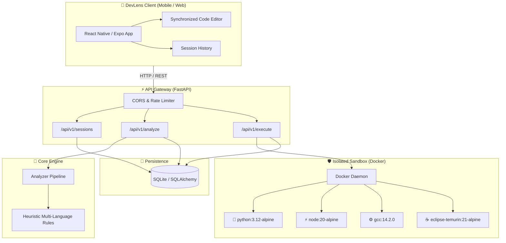

<div align="center">

# 🔍 DevLens

### *The Intelligent On-the-Go Code Debugger & Zero-Trust Sandbox*

[](https://fastapi.tiangolo.com)
[](https://reactnative.dev)
[](https://www.typescriptlang.org/)
[](https://www.docker.com)
[](https://python.org)
[](https://github.com/Bit-manipulators/DevLense)
[](LICENSE)

<p align="center">
  <b>DevLens</b> empowers software engineers to analyze, explain, fix, and execute code right from their mobile device or workstation with sub-second feedback and isolated container sandboxing.
</p>

[✨ Key Features](#-key-features) •
[🏗️ Architecture](#-system-architecture) •
[🚀 Quick Start](#-quick-start) •
[🛡️ Sandboxing & Security](#-security--sandboxing) •
[📡 API Reference](#-api-reference) •
[🧪 Testing](#-testing)

---

</div>

## 🌟 Key Features

<table>
  <tr>
    <td width="50%">
      <h3>🧠 Instant Code Diagnostics</h3>
      Heuristic static analysis engine with multi-language rule parsers. Detects syntax errors, edge cases, off-by-one errors, infinite loops, and unhandled exceptions across <b>Python, JavaScript, C++, and Java</b>.
    </td>
    <td width="50%">
      <h3>🛡️ Zero-Trust Docker Sandbox</h3>
      Safely execute untrusted code in an ephemeral container. Hardened with <b>no network access</b>, <b>read-only filesystem</b>, <b>dropped capabilities</b>, <b>256MB RAM limit</b>, and automatic orphan container cleanup.
    </td>
  </tr>
  <tr>
    <td width="50%">
      <h3>📱 Sleek Cross-Platform UI</h3>
      Built with <b>Expo & React Native</b> for web and mobile. Features synchronized line numbering, responsive error gutter indicators, tab navigation, and smooth one-tap bug repair diff views.
    </td>
    <td width="50%">
      <h3>⚡ Resilient Backend API</h3>
      Engineered on <b>FastAPI & SQLAlchemy 2.0</b> with asynchronous Proactor event loops, optimized <code>selectinload</code> queries preventing N+1 overhead, and token-bucket client rate limiting.
    </td>
  </tr>
</table>

---

## 🏗️ System Architecture



---

## 📂 Project Structure

```text
devlens/
├── 🐍 backend/
│   ├── app/
│   │   ├── api/routes/          # REST endpoints (analyze, execute, sessions, health)
│   │   ├── analyzers/           # Multi-language static analysis rules (Python, JS, C++, Java)
│   │   ├── execution/           # Docker sandboxing manager & container lifecycle
│   │   ├── models/              # SQLAlchemy 2.0 ORM schemas & Pydantic DTOs
│   │   ├── services/            # Session persistence & query services
│   │   └── utils/               # Rate limiters & logging helpers
│   ├── tests/                   # Pytest test suite (100% passing)
│   └── requirements.txt         # FastAPI, Uvicorn, SQLAlchemy dependencies
├── 📱 mobile/
│   ├── app/                     # Expo Router pages (index, history, session detail)
│   ├── components/              # Synchronized CodeEditor, Header, ErrorBoundary
│   ├── hooks/                   # Custom state & network hooks
│   ├── services/                # Typed API client with 204 safe-deletion support
│   └── package.json             # React Native, Expo 51, TypeScript
├── 🐳 docker-compose.yml        # Unified container orchestration
└── 📄 README.md                 # Project documentation
```

---

## 🚀 Quick Start

### 1️⃣ Backend Setup

> **Prerequisites:** Python 3.12+ (or 3.13)

```powershell
cd backend

# 1. Initialize environment configuration
Copy-Item .env.example .env

# 2. Setup virtual environment
python -m venv .venv
.\.venv\Scripts\Activate.ps1

# 3. Install dependencies
pip install -r requirements.txt

# 4. Launch FastAPI development server
uvicorn app.main:app --reload --host 0.0.0.0 --port 8001
```

* 📚 **Interactive Swagger Docs:** [`http://localhost:8001/docs`](http://localhost:8001/docs)
* 💓 **Health & Sandbox Status:** [`http://localhost:8001/api/v1/health`](http://localhost:8001/api/v1/health)

---

### 2️⃣ Mobile / Web Client Setup

> **Prerequisites:** Node.js 20+ & [Expo Go](https://expo.dev/go) (or browser)

```powershell
cd mobile

# 1. Initialize environment configuration
Copy-Item .env.example .env

# 2. Install dependencies
npm install

# 3. Start Expo development server
npx expo start
```

* 🌐 **Web Browser:** Press `w` in the terminal or navigate to [`http://localhost:8081`](http://localhost:8081).
* 📱 **Physical Phone:** Set `EXPO_PUBLIC_API_URL=http://<YOUR_LAN_IP>:8001` in `mobile/.env`, connect your phone to the same Wi-Fi, and scan the QR code using the **Expo Go** app.

---

### 3️⃣ Docker Execution Sandbox

DevLens checks Docker daemon availability in real-time. If Docker is running, **"Run in Sandbox"** automatically compiles and executes code inside isolated micro-containers.

Supported runtime containers:
- 🐍 **Python:** `python:3.12-alpine`
- ⚡ **JavaScript:** `node:20-alpine`
- ⚙️ **C++:** `gcc:14.2.0`
- ☕ **Java:** `eclipse-temurin:21-alpine`

---

## 🛡️ Security & Sandboxing

DevLens enforces a **Zero Host-Code Execution** policy. Untrusted code submitted by clients is never run directly on the host machine.

| Security Control | Parameter | Purpose |
| :--- | :--- | :--- |
| **Network Isolation** | `--network none` | Completely prevents inbound and outbound network calls (anti-exfiltration, anti-SSRF). |
| **Filesystem Hardening** | `--read-only` | Root filesystem is immutable; code is executed in an ephemeral bind mount. |
| **Privilege Revocation** | `--cap-drop ALL` | Strips all Linux root capabilities. |
| **Anti-Escalation** | `--security-opt no-new-privs` | Prevents sub-processes from acquiring elevated privileges via setuid/setgid. |
| **Memory Capping** | `-m 256M` | Enforces strict hard limit on RAM usage. |
| **CPU Throttling** | `--cpus 0.5` | Restricts runaway loops from degrading host CPU performance. |
| **Process Cap** | `--pids-limit 64` | Prevents fork bombs and process starvation. |
| **Hard Timeout** | `5 seconds` | Container processes are unconditionally terminated and pruned upon timeout. |

---

## 📡 API Reference

| Method | Endpoint | Description | Status Code |
| :---: | :--- | :--- | :---: |
| `POST` | `/api/v1/analyze` | Parse source code, detect bugs, and generate corrected solution | `201 Created` |
| `POST` | `/api/v1/execute` | Execute validated code in the secure Docker container | `200 OK` / `503` |
| `POST` | `/api/v1/ocr` | Extract source code and detect language from camera photo or screenshot | `200 OK` |
| `POST` | `/api/v1/agent/chat` | Chat with DevLens Copilot (Ollama LLM with offline heuristic fallback) | `200 OK` |
| `GET` | `/api/v1/sessions` | Fetch paginated debugging sessions (`?limit=50&offset=0`) | `200 OK` |
| `GET` | `/api/v1/sessions/{id}` | Retrieve comprehensive session details, diffs, and executions | `200 OK` |
| `DELETE` | `/api/v1/sessions/{id}` | Permanently remove a session and associated execution logs | `204 No Content` |
| `GET` | `/api/v1/health` | Query API health and Docker sandbox availability | `200 OK` |

---

## 🧪 Testing

Both backend and frontend feature full test suites ensuring stability and regression prevention:

```powershell
# 1. Run backend unit & integration tests
cd backend
.\.venv\Scripts\python.exe -m pytest -v

# 2. Run mobile unit tests and TypeScript check
cd ..\mobile
npm test
npm run typecheck
```

All 20 backend tests and 4 frontend test suites (11 unit tests) pass with zero warnings.

---

## 📱 Android APK & Phone Installation

DevLens includes an automated GitHub Actions CI pipeline that builds a standalone Android APK on every push and publishes it directly to GitHub Releases.

* **Direct Phone Download:** Download `devlens-v0.1.0-debug.apk` from [GitHub Releases](https://github.com/Myparadox-creator/DevLense/releases) directly on your Android phone browser.
* **USB Cable 1-Click Install:** Connect your Android phone with USB debugging enabled and run:
  ```powershell
  .\scripts\install-to-phone.ps1
  ```
* **EAS Cloud Build:** Run `cd mobile && eas build -p android --profile preview` to build via Expo Application Services.
* **Full Guide:** See [docs/APK_CI_AND_INSTALLATION.md](docs/APK_CI_AND_INSTALLATION.md) for step-by-step instructions.

---

## 🗺️ Roadmap

- [x] Python, JavaScript, C++, and Java heuristic rule analyzer
- [x] Zero-trust Docker execution sandbox with auto-orphan cleanup
- [x] $N+1$ query optimization via `selectinload` & paginated sessions API
- [x] Safe HTTP 204 mobile deletion & web browser extension error interception
- [x] Camera & Gallery OCR code scanner with confidence review modal
- [x] Interactive AI Debugging Agent (DevLens Copilot) with Ollama & Heuristic fallback
- [x] Automated Android APK CI pipeline & direct phone installation guide
- [ ] Multi-tenant authentication (JWT / OAuth2) & PostgreSQL storage
- [ ] Distributed runner worker fleet via Redis / Celery
- [ ] Tree-sitter AST parser integration for advanced multi-language analysis
- [ ] Voice dictation integration

---

<div align="center">

### Built with precision for developers who debug everywhere.

<sub>Released under the [MIT License](LICENSE). Copyright © 2026 DevLens Contributors.</sub>

</div>
