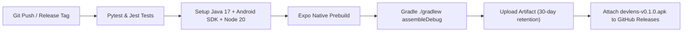

# 📱 DevLens Android APK: CI Pipeline & Physical Device Installation Guide

This guide details the complete end-to-end process for building, installing, and configuring the DevLens Android standalone application on physical Android smartphones and emulators.

---

## 📑 Table of Contents

- [1. Automated GitHub Actions CI Pipeline](#1-automated-github-actions-ci-pipeline)
- [2. Installation Methods on Physical Phone](#2-installation-methods-on-physical-phone)
  - [Option A: Direct Download via Phone Browser (Easiest)](#option-a-direct-download-via-phone-browser-easiest)
  - [Option B: 1-Click USB Installation via ADB Script](#option-b-1-click-usb-installation-via-adb-script)
  - [Option C: Cloud Build via Expo EAS](#option-c-cloud-build-via-expo-eas)
- [3. Connecting the App to Your Local Backend](#3-connecting-the-app-to-your-local-backend)
  - [Method 1: Wi-Fi LAN Bridge](#method-1-wi-fi-lan-bridge)
  - [Method 2: USB Cable ADB Reverse Tunnel (Zero Wi-Fi Required)](#method-2-usb-cable-adb-reverse-tunnel-zero-wi-fi-required)
- [4. Troubleshooting & FAQ](#4-troubleshooting--faq)

---

## 1. Automated GitHub Actions CI Pipeline

DevLens includes an automated CI/CD workflow defined in [`.github/workflows/build-apk.yml`](../.github/workflows/build-apk.yml). Whenever commits are pushed to `main` or release tags are created:



### Pipeline Steps:
1. **Automated Validation:** Executes Pytest suite for backend and Jest for mobile.
2. **Environment Matrix:** Provisions Java 17 Temurin, Node.js 20, and Android Command-line Tools.
3. **Native Prebuild:** Synthesizes Android native Gradle workspace via `npx expo prebuild --platform android --clean`.
4. **Gradle Compilation:** Builds debug APK with bundled assets via `./gradlew assembleDebug`.
5. **Distribution:** Publishes the APK to GitHub Actions Artifacts and GitHub Releases.

---

## 2. Installation Methods on Physical Phone

### Option A: Direct Download via Phone Browser (Easiest)

1. Open Chrome, Brave, or Firefox on your Android device.
2. Navigate to your repository releases page:  
   👉 `https://github.com/Bit-manipulators/DevLense/releases`
3. Tap the latest release and download **`devlens-v0.1.0.apk`**.
4. Once downloaded, tap the notification or open your **Downloads** folder to install.
5. **If Android displays security prompts:**
   * *"For your security, your phone is not allowed to install unknown apps from this source"*:  
     Tap **Settings** $\to$ Toggle **Allow from this source** $\to$ Tap **Back** $\to$ Tap **Install**.
   * *"Play Protect warning: Unrecognized app"*:  
     Tap **More details** $\to$ Tap **Install anyway** (standard verification for debug-signed development builds).

---

### Option B: 1-Click USB Installation via ADB Script

If your phone is connected to your development workstation with a USB cable:

#### Step 1: Enable USB Debugging on Your Smartphone
1. Open **Settings** $\to$ **About Phone**.
2. Tap **Build Number** 7 times until you see *"You are now a developer!"*.
3. Return to **Settings** $\to$ **System** $\to$ **Developer Options**.
4. Enable **USB Debugging**.
5. Connect your phone via USB and tap **"Always allow from this computer"** on the prompt.

#### Step 2: Run the Automated Installer Script
From the project root in PowerShell:
```powershell
.\scripts\install-to-phone.ps1
```
Or specify a custom APK path:
```powershell
.\scripts\install-to-phone.ps1 -ApkPath "C:\path\to\devlens.apk"
```

The script automatically detects `adb`, checks device authorization, installs the application, and launches DevLens on your screen.

---

### Option C: Cloud Build via Expo EAS

If you want to compile custom builds in the cloud:

```bash
# 1. Install EAS CLI
npm install -g eas-cli

# 2. Authenticate
eas login

# 3. Trigger cloud Android preview build
cd mobile
eas build -p android --profile preview
```

Upon completion, Expo generates a QR code and download URL directly on your terminal.

---

## 3. Connecting the App to Your Local Backend

Because DevLens mobile communicates with your local FastAPI backend running on your PC (port `8001`), configure network routing as follows:

### Method 1: Wi-Fi LAN Bridge

1. Connect your PC and phone to the **same Wi-Fi router / mobile hotspot**.
2. Identify your PC's local IP address:
   * **Windows:** `ipconfig` (look for `IPv4 Address`, e.g., `192.168.1.15`)
   * **Linux/macOS:** `ifconfig` or `ip a`
3. Configure `mobile/.env` before launching or building:
   ```env
   EXPO_PUBLIC_API_URL=http://192.168.1.15:8001
   ```
4. Verify backend connectivity by visiting `http://192.168.1.15:8001/api/v1/health` on your phone browser.

---

### Method 2: USB Cable ADB Reverse Tunnel (Zero Wi-Fi Required)

If you are debugging via USB cable, port-forward the backend directly through the cable:

```bash
adb reverse tcp:8001 tcp:8001
```

Now, the mobile app can reach your backend at `http://localhost:8001` directly through the USB cable!

---

## 4. Troubleshooting & FAQ

| Problem | Cause | Solution |
| :--- | :--- | :--- |
| **`adb: device unauthorized`** | Phone hasn't accepted USB RSA prompt | Unlock phone, disconnect/reconnect USB, and tap "Always Allow". |
| **`INSTALL_FAILED_UPDATE_INCOMPATIBLE`** | Existing version has conflicting signature | Uninstall previous DevLens app on phone, then reinstall. |
| **`Network request failed` on phone** | Firewall blocking port 8001 | Add firewall inbound rule for port 8001 on your development PC. |
| **App crashes on startup** | Architecture mismatch | Use universal APK build or build with `--platform android`. |
