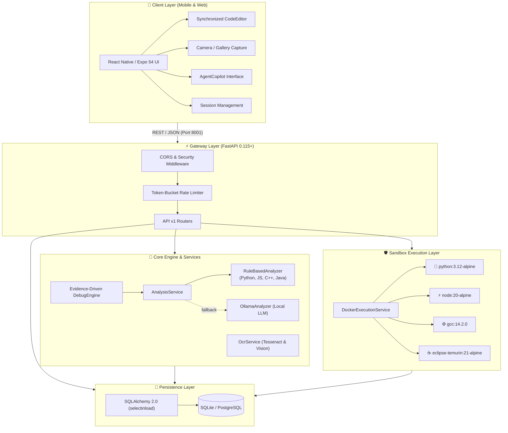
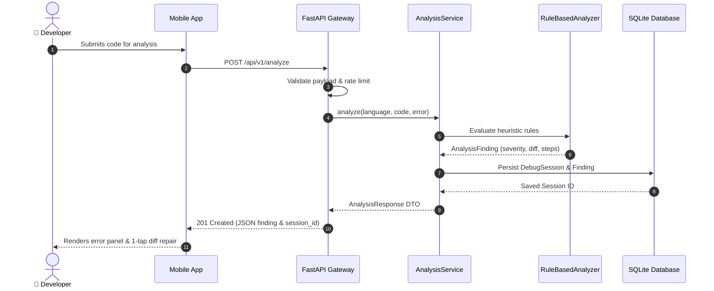
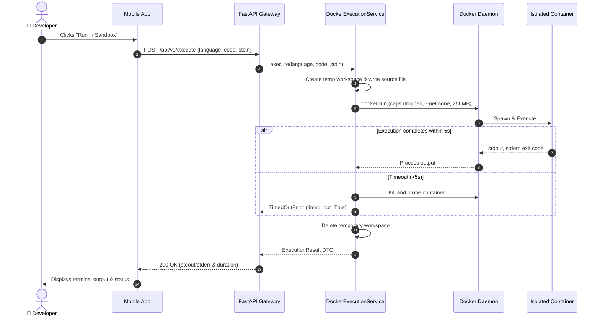
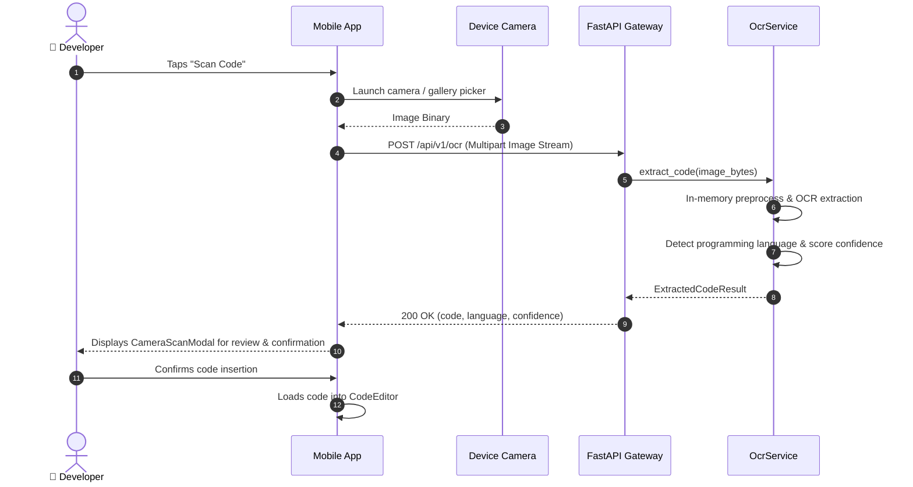
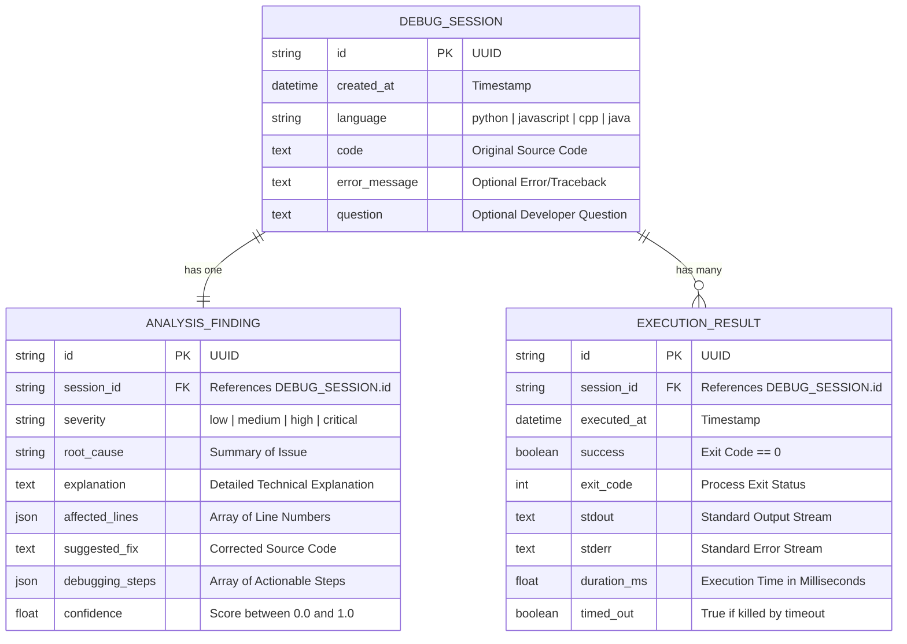
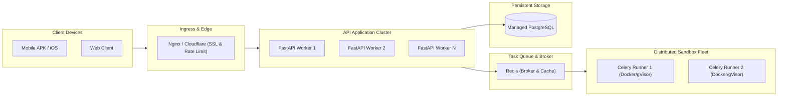

# 🏗️ DevLens System Architecture & Technical Design

> **Document Version:** 2.0  
> **Status:** Production Architecture & Specification  
> **Target Audience:** Core Contributors, System Architects, Security Engineers

---

## 📑 Table of Contents

- [1. Architectural Vision & Principles](#1-architectural-vision--principles)
- [2. High-Level System Topology](#2-high-level-system-topology)
- [3. Subsystem Breakdown](#3-subsystem-breakdown)
  - [3.1 Client & Presentation Layer](#31-client--presentation-layer)
  - [3.2 API Gateway & Security Perimeter](#32-api-gateway--security-perimeter)
  - [3.3 Static Diagnostics & AI Engine](#33-static-diagnostics--ai-engine)
  - [3.4 Zero-Trust Execution Sandbox](#34-zero-trust-execution-sandbox)
  - [3.5 In-Memory OCR Pipeline](#35-in-memory-ocr-pipeline)
  - [3.6 Persistence & Data Models](#36-persistence--data-models)
- [4. Execution & Data Flow Sequences](#4-execution--data-flow-sequences)
  - [4.1 Code Diagnostics & Analysis Flow](#41-code-diagnostics--analysis-flow)
  - [4.2 Ephemeral Sandboxed Execution Flow](#42-ephemeral-sandboxed-execution-flow)
  - [4.3 Camera Scan & OCR Ingestion Flow](#43-camera-scan--ocr-ingestion-flow)
- [5. Entity Relationship (ER) Schema](#5-entity-relationship-er-schema)
- [6. Scalability & Deployment Pathways](#6-scalability--deployment-pathways)

---

## 1. Architectural Vision & Principles

DevLens is designed to provide developer tooling directly on mobile devices without sacrificing security, performance, or privacy.

### Core Architectural Tenets
1. **Zero Host Execution:** Untrusted user code is *never* executed on the API host operating system. All execution happens in ephemeral micro-containers.
2. **Graceful Fallbacks & Offline Resilience:** If external services or LLM providers (e.g., Ollama) are offline, the system seamlessly falls back to fast, offline deterministic heuristic engines.
3. **Sub-second Feedback Loops:** Lightweight static parsers and connection pooling guarantee sub-second diagnostic responses.
4. **Zero Data Retention for Sensory Inputs:** OCR images are processed in-memory streams and discarded immediately; images are never written to disk or the database.

---

## 2. High-Level System Topology

---

## 3. Subsystem Breakdown

### 3.1 Client & Presentation Layer ([`mobile/`](../mobile))
* **Framework:** React Native built with Expo (Expo Router v3).
* **Cross-Platform Target:** Android native (APK), iOS (via Expo Go), and Desktop Web (`http://localhost:8081`).
* **Key Components:**
  * [`CodeEditor.tsx`](../mobile/components/CodeEditor.tsx): Custom synchronized line-numbered editor with visual error gutter indicators and real-time cursor syncing.
  * [`CameraScanModal.tsx`](../mobile/components/CameraScanModal.tsx): Interactive preview modal showing extracted code, confidence scoring, and one-tap language selection.
  * [`AgentCopilot.tsx`](../mobile/components/AgentCopilot.tsx): Conversational assistant offering algorithmic optimization, test synthesis, and code repairs.
  * [`ErrorPanel.tsx`](../mobile/components/ErrorPanel.tsx) & [`FixPanel.tsx`](../mobile/components/FixPanel.tsx): Severity badges and one-tap diff application widgets.

### 3.2 API Gateway & Security Perimeter ([`backend/app/api/`](../backend/app/api))
* **Framework:** FastAPI running on Uvicorn with asynchronous event loops.
* **Security Middleware:** Injects standard browser defense headers (`nosniff`, `frame-ancestors 'none'`, `no-store`).
* **Rate Limiting:** Token-bucket algorithm per client IP address.
* **Validation:** Strict Pydantic v2 schemas validating request sizes and input sanitization before reaching core logic.

### 3.3 Evidence-Driven Debug Engine & Static Diagnostics ([`backend/app/orchestrator/`](../backend/app/orchestrator) & [`backend/app/analysis/`](../backend/app/analysis))
* **Master Orchestrator:** `EvidenceDebugOrchestrator` coordinates the 10-phase debugging pipeline: problem ingestion, multi-layer diagnostics, dynamic test synthesis, sandbox execution, root cause reasoning, patch synthesis, regression validation, and diff packaging.
* **Multi-Layer Static Diagnostics:**
  * **Syntax:** AST parser-backed verification across Python, JavaScript, C++, and Java.
  * **Semantics:** Variable scoping, undefined bindings, type mismatches, and null/None dereferencing.
  * **Edge Cases:** Zero-division, unhandled empty collections, off-by-one boundary conditions.
  * **Complexity:** Cyclomatic complexity and heuristic Big-O runtime/space estimation.
* **Deterministic Rule Analyzers:** Backward-compatible AST rule parsers for fast sub-millisecond responses.
* **AI Provider Fallback:** Connects to local Ollama instances when available; seamlessly falls back to deterministic rule engines if Ollama is unreachable.

### 3.4 Two-Tier Hybrid Execution Sandbox ([`backend/app/execution/`](../backend/app/execution))
* **Hybrid Execution Manager (`HybridExecutionManager`):** Intelligently routes code execution between Docker micro-containers and OS Process Jail.
* **Tier 1: Docker Micro-Containers (`DockerExecutionService`):**
  * `--network none`: Total network isolation.
  * `--read-only`: Read-only root filesystem.
  * `--cap-drop ALL`: Linux capabilities stripped.
  * `--security-opt no-new-privs`: Prevents privilege escalation.
  * Resource Caps: 256MB RAM, 0.5 CPU, 64 max PIDs, 5-second hard execution timeout.
  * Automatic Garbage Collection: Prunes orphan and timed-out containers immediately.
* **Tier 2: Cloud Process Jail Fallback (`ProcessJailExecutionService`):**
  * Invoked automatically when Docker daemon is not present (e.g. Render, lightweight cloud runners, local environments without Docker).
  * Enforces ephemeral isolated temp directory execution, stripped environment variables, strict timeouts, and memory quotas.

### 3.5 In-Memory OCR Pipeline ([`backend/app/services/ocr_service.py`](../backend/app/services/ocr_service.py))
* **Processing:** Streams image bytes through PIL without saving files to host disk.
* **Engine:** Tesseract OCR (with custom config tuned for monospace code) + Ollama Vision fallback.
* **Confidence & Normalization:** Calculates character confidence, normalizes indentation, removes visual artifacts, and auto-detects target programming language.

### 3.6 Persistence & Data Models ([`backend/app/models/`](../backend/app/models))
* **ORM:** SQLAlchemy 2.0 declarative models with async query capabilities.
* **Optimization:** Utilizes `selectinload` eager loading on relationships to prevent $N+1$ query degradation.
* **Storage:** SQLite 3 for local single-user instances, ready for PostgreSQL migration in distributed environments.

---

## 4. Execution & Data Flow Sequences

### 4.1 Code Diagnostics & Analysis Flow

---

### 4.2 Ephemeral Sandboxed Execution Flow

---

### 4.3 Camera Scan & OCR Ingestion Flow

---

## 5. Entity Relationship (ER) Schema

---

## 6. Scalability & Deployment Pathways

| Deployment Tier | Infrastructure | Capacity |
| :--- | :--- | :--- |
| **Local Developer (Current)** | SQLite + Local Docker Daemon + Single Uvicorn Instance | 1 user, real-time development |
| **Team Server** | PostgreSQL + Docker Compose + Gunicorn multi-worker | 10–50 concurrent developers |
| **Enterprise Cloud** | Managed PostgreSQL + Kubernetes (K8s) + gVisor/Firecracker Sandbox fleet + Redis | Unlimited multi-tenant scale |
