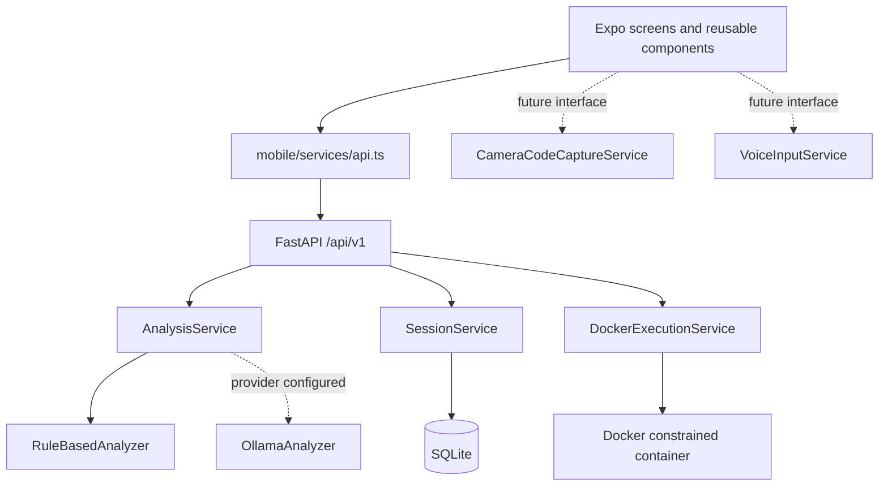

# Architecture

DevLens separates user experience, API coordination, analysis, persistence, and execution so that optional capabilities cannot weaken the default path.

## Analysis providers

`AnalyzerProvider` defines one asynchronous `analyze` contract. Configuration selects rule-based analysis by default. If the optional Ollama provider is selected but unreachable, `AnalysisService` catches that failure and runs `RuleBasedAnalyzer`; the client still receives a legitimate local analysis.

## Data model

`DebugSession` holds the submitted source, input context, and structured finding. `ExecutionResult` belongs to a session when a `session_id` is supplied, and persists stdout/stderr, exit information, and duration. SQLite is suitable for a single-user MVP; production needs a managed database and data retention policy.

## Execution boundary

The API treats submitted source as untrusted data. It creates a unique temporary directory, writes a language-specific source file, and invokes Docker through fixed argument lists—never a host shell string built from code. Each container has no network, a read-only root filesystem, a small writable work mount, memory/CPU/PID limits, a timeout, dropped Linux capabilities, and a capped response body.

`DockerExecutionService` is the only production implementation. It raises a configuration error when Docker is not available. A local host execution fallback would violate DevLens's safety contract.

