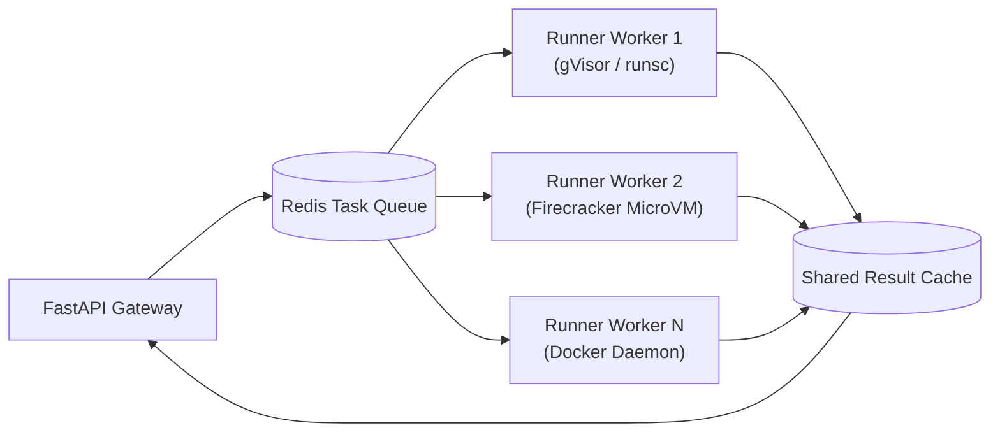
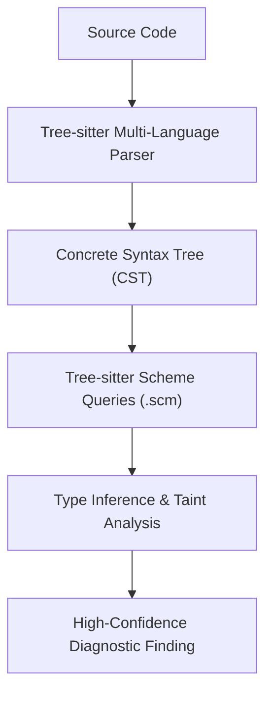
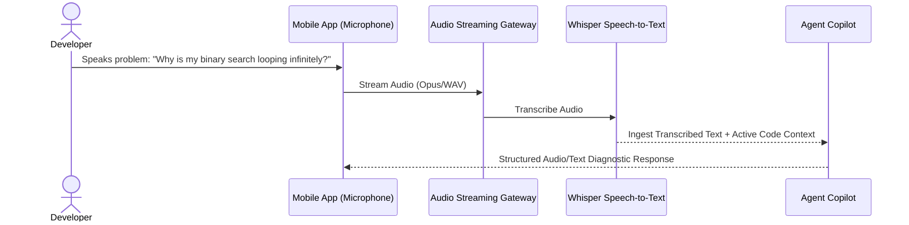

# 🚀 DevLens Future Capabilities & Feature Roadmap

> **Document Status:** Active Technical Roadmap & Specification  
> **Last Updated:** 2026

---

## 📑 Table of Contents

- [1. Implemented Features Overview](#1-implemented-features-overview)
- [2. Distributed Sandbox Execution Fleet](#2-distributed-sandbox-execution-fleet)
- [3. Tree-sitter AST & Deep Static Analysis](#3-tree-sitter-ast--deep-static-analysis)
- [4. Voice Dictation & Audio Diagnostic Assistant](#4-voice-dictation--audio-diagnostic-assistant)
- [5. Real-Time Multi-Device Collaborative Debugging](#5-real-time-multi-device-collaborative-debugging)
- [6. Multi-Tenant Cloud Architecture & OAuth2](#6-multi-tenant-cloud-architecture--oauth2)

---

## 1. Implemented Features Overview

DevLens has successfully shipped the following core capabilities:

- [x] **Zero-Trust Docker Sandbox:** Ephemeral, isolated, resource-capped container execution across Python, JavaScript, C++, and Java.
- [x] **Multi-Language Heuristic Diagnostics:** Instant AST and pattern-based rule analyzer with calibrated confidence scoring.
- [x] **Camera & Gallery OCR Code Capture:** In-memory stream OCR with monospace character filtering, confidence review modal, and language auto-detection.
- [x] **Interactive AI Copilot Agent:** Conversational reasoning, algorithmic optimization, and one-tap code repairs with local Ollama LLM and heuristic fallbacks.
- [x] **Automated Android CI Pipeline:** GitHub Actions automated APK builds and physical device installation scripts.

---

## 2. Distributed Sandbox Execution Fleet

### Objective
Scale execution beyond a single host Docker daemon to a resilient, distributed runner pool using asynchronous task queues.

### Technical Design:
* **Message Broker:** Celery + Redis for asynchronous execution dispatch.
* **MicroVM Isolation:** Evaluate **Firecracker** or **gVisor (`runsc`)** for sub-millisecond container startups with virtualized hardware isolation.
* **Stateless Autoscaling:** Runner workers scale up dynamically based on queue depth.

---

## 3. Tree-sitter AST & Deep Static Analysis

### Objective
Supplement regex and basic AST heuristics with industrial-grade concrete syntax trees via **Tree-sitter**.

### Key Capabilities:
* Incremental parsing for instant keystroke-by-keystroke diagnostics in the mobile editor.
* Formal Control Flow Graph (CFG) and Data Flow Graph (DFG) generation for detecting complex race conditions and deadlocks.
* Uniform query syntax across Python, JavaScript, TypeScript, C++, Rust, and Go.

---

## 4. Voice Dictation & Audio Diagnostic Assistant

### Objective
Enable hands-free code debugging via device microphone, speech-to-text, and conversational problem description.

### Security & Privacy Controls:
* Zero audio storage on servers; ephemeral in-memory processing.
* Explicit user permission prompt required before activating microphone stream.

---

## 5. Real-Time Multi-Device Collaborative Debugging

### Objective
Enable pairing between mobile devices, tablets, and desktop workstations with live synchronized code cursors, shared execution results, and paired debugging sessions.

### Technical Design:
* **Transport:** WebSockets / WebRTC data channels.
* **Conflict Resolution:** Conflict-free Replicated Data Types (CRDTs) via Yjs or Automerge.
* **End-to-End Encryption:** Session keys exchanged peer-to-peer using ECDH.

---

## 6. Multi-Tenant Cloud Architecture & OAuth2

### Objective
Provide enterprise cloud syncing, organization workspaces, and authenticated session history.

* **Identity Providers:** GitHub, Google, and GitLab OAuth2 / OIDC login.
* **Storage:** PostgreSQL with multi-tenant row-level security (RLS).
* **Role-Based Access Control (RBAC):** Admin, Developer, and Viewer permissions for team debugging sessions.
