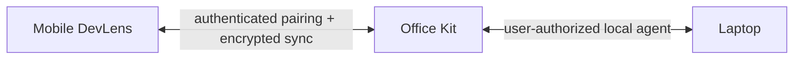

# Future Office Kit / laptop integration

This MVP does not connect to a laptop or Office Kit. The intended future design is an authenticated, user-approved pairing channel:

Possible later capabilities include approved clipboard transfer, importing a Git diff, dispatching code to a laptop runner, and retrieving compiler output. Each needs explicit user consent, device identity, expiry/revocation, and an audit trail. Never report a laptop as connected until this protocol is actually implemented.

