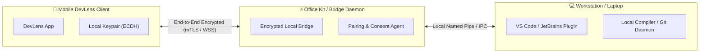

# 🖥️ Office Kit & Workstation Companion Integration Specification

> **Status:** Future Specification & Design Proposal  
> **Target:** DevLens Hardware Companion & Laptop Bridge

---

## 📑 Table of Contents

- [1. Integration Overview](#1-integration-overview)
- [2. System Topology & Pairing Protocol](#2-system-topology--pairing-protocol)
- [3. Cryptographic Handshake & Key Exchange](#3-cryptographic-handshake--key-exchange)
- [4. Core Workstation Capabilities](#4-core-workstation-capabilities)
  - [4.1 Secure Clipboard Sync](#41-secure-clipboard-sync)
  - [4.2 Git Diff Ingestion](#42-git-diff-ingestion)
  - [4.3 Workstation Remote Execution Proxy](#43-workstation-remote-execution-proxy)
- [5. Security & Revocation Model](#5-security--revocation-model)

---

## 1. Integration Overview

The **DevLens Office Kit** is an upcoming companion integration that bridges the mobile DevLens application with a developer's desktop or laptop workstation over a localized, zero-trust encrypted link.

---

## 2. System Topology & Pairing Protocol

---

## 3. Cryptographic Handshake & Key Exchange

1. **Discovery:** Mobile app detects workstation daemon via mDNS (Bonjour/ZeroConf) on local network or scans a dynamic QR code displayed on the laptop terminal.
2. **Key Agreement:** Devices perform an **Elliptic Curve Diffie-Hellman (ECDH)** key exchange to derive a shared session key ($K_{session}$).
3. **Out-of-Band Verification:** Both devices display a 6-digit Short Authentication String (SAS) or QR code for user verification against Man-in-the-Middle (MitM) attacks.
4. **Transport Security:** All subsequent payload messages are encrypted using **AES-256-GCM** or **ChaCha20-Poly1305**.

---

## 4. Core Workstation Capabilities

### 4.1 Secure Clipboard Sync
* Allows developers to securely push code snippets from their laptop editor directly into their mobile DevLens workspace with one keystroke (`Ctrl+Shift+D` / `Cmd+Shift+D`).
* Enforces explicit user confirmation on the phone before accepting clipboard payloads.

### 4.2 Git Diff Ingestion
* Automatically imports local staged Git diffs (`git diff --staged`) into DevLens for mobile code review, bug diagnostics, and pre-commit verification.

### 4.3 Workstation Remote Execution Proxy
* Offloads heavy compilation tasks (e.g., large C++ projects, Rust builds, or multi-module Java builds) from the mobile device to the developer's laptop Docker daemon while streaming stdout/stderr back to the smartphone screen in real-time.

---

## 5. Security & Revocation Model

* **Explicit User Authorization:** Every connection attempt must be approved by the developer on the workstation screen.
* **Transient Session Lifetimes:** Pairing tokens expire automatically after a configurable period (default: 8 hours).
* **Instant One-Tap Revocation:** A single tap in DevLens Settings immediately revokes all paired workstations and purges cryptographic session keys.
* **Audit Trail:** All remote executions and file transfers are logged locally on the workstation.
