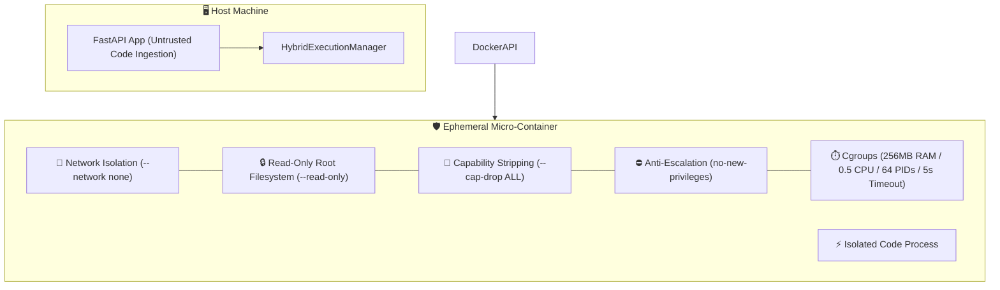

# 🛡️ DevLens Security Architecture & Threat Model

> **Classification:** Public Security Specification & Whitepaper  
> **Target Audience:** Security Engineers, Auditors, DevOps, Core Maintainers

---

## 📑 Table of Contents

- [1. Security Philosophy & Threat Stance](#1-security-philosophy--threat-stance)
- [2. Defense-in-Depth Container Sandboxing](#2-defense-in-depth-container-sandboxing)
- [3. STRIDE Threat Analysis Matrix](#3-stride-threat-analysis-matrix)
- [4. API Perimeter & Gateway Hardening](#4-api-perimeter--gateway-hardening)
- [5. AI & LLM Security Guardrails](#5-ai--llm-security-guardrails)
- [6. Data Privacy & Zero Sensory Retention](#6-data-privacy--zero-sensory-retention)
- [7. Production Deployment Security Checklist](#7-production-deployment-security-checklist)

---

## 1. Security Philosophy & Threat Stance

DevLens accepts arbitrary, potentially untrusted, and malicious source code from end users. The core security architecture employs a **Two-Tier Hybrid Sandboxing** model:

> 🛡️ **Isolation Guarantees:**  
> * **Tier 1 (Production / Full Isolation):** Untrusted code executes inside ephemeral Docker micro-containers with zero network access, read-only root filesystems, stripped Linux capabilities, and strict cgroups memory/CPU throttling.
> * **Tier 2 (Cloud / Serverless Fallback):** When running in restricted cloud environments without a Docker daemon (e.g. Render, AWS App Runner, or local environments without Docker Desktop), `HybridExecutionManager` transparently falls back to `ProcessJailExecutionService`—enforcing sub-second OS-level subprocess sandboxing, isolated ephemeral temp directories, stripped environment variables, and strict memory/timeout watchdogs.

---

## 2. Defense-in-Depth Container Sandboxing

Every code execution is isolated within an ephemeral micro-container adhering to rigorous multi-layered Linux kernel controls:



### Security Control Matrix

| Isolation Layer | Docker Parameter | Security Mechanism & Objective |
| :--- | :--- | :--- |
| **Network Isolation** | `--network none` | Disables network interfaces completely (except loopback). Prevents data exfiltration, SSRF, reverse shells, and external botnet connections. |
| **Filesystem Hardening** | `--read-only` | Root filesystem `/` is mounted read-only. Prevents persistence, system file alteration, or rootkit installation. |
| **Ephemeral Workspace** | `-v <temp_dir>:/workspace:rw` | An isolated temporary directory is mounted exclusively for source compilation and unmounted/deleted immediately upon exit. |
| **Linux Capabilities** | `--cap-drop ALL` | Strips all 41+ Linux root capabilities (including `CAP_NET_RAW`, `CAP_SYS_ADMIN`, `CAP_DAC_OVERRIDE`). |
| **Privilege Escalation** | `--security-opt no-new-privileges` | Blocks child processes from acquiring new privileges via `setuid` / `setgid` binaries. |
| **Memory Hard Limit** | `-m 256M --memory-swap 256M` | Sets a strict physical RAM ceiling and disables swap expansion to prevent host OOM exhaustion. |
| **CPU Quota** | `--cpus 0.5` | Restricts CPU usage to half a core, preventing infinite loops from starving host system resources. |
| **Process / PID Ceiling** | `--pids-limit 64` | Completely neutralizes fork bombs and runaway sub-thread generation. |
| **Hard Watchdog Timeout** | `5 seconds` | Host-side async timer unconditionally kills and prunes unresponsive containers. |
| **Output Truncation** | 50 KB output limit | Caps stdout/stderr buffer to prevent memory exhaustion from log spamming. |

---

## 3. STRIDE Threat Analysis Matrix

| Threat Category | Potential Attack Vector | DevLens Mitigation Strategy | Residual Risk & Action |
| :--- | :--- | :--- | :--- |
| **Spoofing** | Forging client identity | Rate limiting per IP; JWT authentication in production roadmap. | Deploy authenticated API gateway. |
| **Tampering** | Modifying analysis results or DB records | Prepared SQLAlchemy statements and strict Pydantic DTO models. | Database credentials secured in environment. |
| **Repudiation** | Denying malicious code execution | Comprehensive server logs with timestamps and session UUIDs. | Aggregate logs to centralized SIEM in cloud setups. |
| **Information Disclosure** | Reading host system files | Container read-only filesystem + bind mounting only transient workspace. | Ensure host Docker socket is not exposed to web. |
| **Denial of Service** | Fork bombs, memory leaks, runaway loops | Cgroups limits (256MB, 0.5 CPU, 64 PIDs) + 5s hard container timeout. | Rate limit requests per minute. |
| **Elevation of Privilege** | Container breakout / setuid exploits | `--cap-drop ALL`, `--security-opt no-new-privileges`, unprivileged container user. | Keep host kernel and Docker engine updated. |

---

## 4. API Perimeter & Gateway Hardening

### 4.1 Strict Payload Size Bounds
Requests exceeding defined limits are immediately rejected before parsing:
* Source Code: Max 50 KB
* Error / Stacktrace: Max 20 KB
* Question / Prompt: Max 4 KB
* Standard Input (stdin): Max 10 KB

### 4.2 Security Headers
Every HTTP response carries protective headers:
```http
X-Content-Type-Options: nosniff
X-Frame-Options: DENY
Referrer-Policy: no-referrer
Cache-Control: no-store, no-cache, must-revalidate
```

### 4.3 Rate Limiting
Client requests are throttled using an in-memory token-bucket algorithm (default: 60 requests/min per IP).

---

## 5. AI & LLM Security Guardrails

When DevLens interacts with local or cloud LLMs (e.g., Ollama / Vision models):

1. **Code-as-Data Isolation:** Code and user comments are passed strictly as quoted data payloads inside structured prompts, never as system instructions.
2. **Schema Enforcement:** LLM outputs are parsed through rigid Pydantic JSON schemas. Malformed or hallucinatory responses are discarded.
3. **Advisory Role:** AI suggestions are marked advisory; deterministic static rule engines provide the authoritative baseline.

---

## 6. Data Privacy & Zero Sensory Retention

* **In-Memory OCR Streams:** Captured camera images and gallery uploads are processed purely in RAM streams. No images are written to persistent storage, disk caches, or databases.
* **Session Ownership:** Session data contains code and diagnostic findings only, with safe cascading deletions (`DELETE /api/v1/sessions/{id}`).

---

## 7. Production Deployment Security Checklist

When deploying DevLens in multi-user or enterprise cloud environments:

- [ ] **TLS 1.3 Encryption:** Enforce HTTPS via an Ingress Controller or reverse proxy (Nginx, Traefik, Cloudflare).
- [ ] **Authentication Layer:** Enable OAuth2 / OIDC or JWT token validation at the API Gateway.
- [ ] **Distributed Runner Fleet:** Move execution from the API host to a dedicated worker pool using **gVisor (runsc)** or **Firecracker MicroVMs**.
- [ ] **Distributed Rate Limiter:** Replace in-memory rate limiting with Redis-backed token buckets.
- [ ] **Secrets Management:** Store configuration and database credentials in Vault or Cloud Secret Manager.
