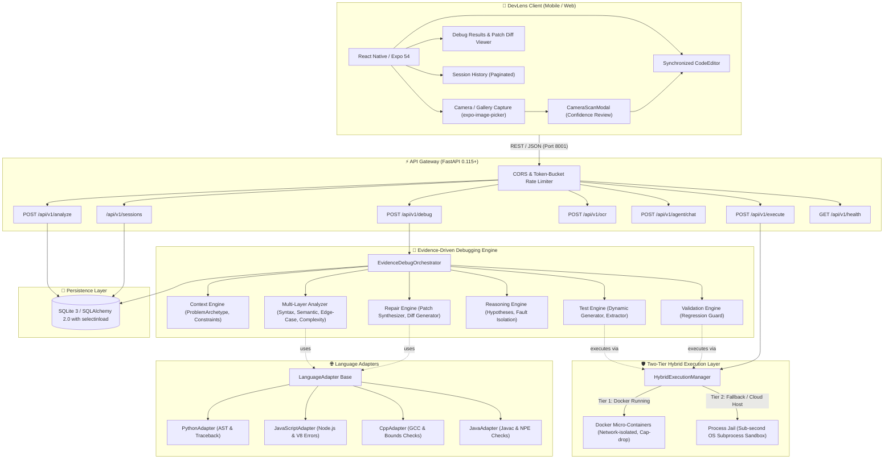

# 🧠 DevLens: Project Brain & Architectural Knowledge Base

> **Single Source of Truth** for developers, system architects, and AI pair-programming agents working on the DevLens ecosystem.

---

## 📌 1. Executive Summary & Mission

**DevLens** is an intelligent, multi-language, evidence-driven code analysis, automated debugging, and secure sandboxing ecosystem. Engineered for both high-assurance developer environments and on-the-go mobile workflows (iOS, Android, Web), DevLens transforms raw problem statements, error traces, and source code into verified, non-regressive repairs.

### Core Value Propositions
1. **Evidence-Driven Debugging Pipeline (`/api/v1/debug`):** Synthesizes problem context, runs multi-layered static diagnostics (syntax, semantics, edge cases, complexity), generates targeted unit test cases, executes code in a sandboxed runtime, isolates root causes, synthesizes unified diff patches, and validates repairs against regressions.
2. **True Multi-Language Coverage:** Deep syntactic, semantic, execution, and repair pipelines for **Python, JavaScript (Node.js), C++ (GCC), and Java (OpenJDK)** with language-tailored test harnesses and compile/runtime diagnostics.
3. **Two-Tier Hybrid Sandboxing:** Executes untrusted code inside zero-trust Docker micro-containers with strict resource limits and capability drops. If Docker is unavailable (e.g., restricted cloud environments or local dev setups), it automatically falls back to a sub-second OS-level process jail.
4. **Camera & Gallery OCR Code Capture:** Photographs code off physical monitors, whiteboards, or printouts, extracts characters in-memory via multi-provider OCR (Vision LLM / Tesseract / Heuristic token scanner), auto-detects programming languages, and presents an interactive confidence-scored review modal before workspace insertion.
5. **Adaptive Cross-Platform Topology:** Operates identically across native Android/iOS (Expo Go / standalone APK), desktop web browsers, Wi-Fi LAN bridges, and high-speed USB ADB reverse channels.

---

## 🏗️ 2. System Architecture & Topology



---

## 📂 3. Directory Map & Component Responsibilities

```text
devlens/
├── 🐍 backend/                          # FastAPI Python Application
│   ├── app/
│   │   ├── api/
│   │   │   ├── routes/                  # API Route Controllers
│   │   │   │   ├── debug.py             # POST /api/v1/debug (Evidence-driven pipeline)
│   │   │   │   ├── analysis.py          # POST /api/v1/analyze (Heuristic analysis)
│   │   │   │   ├── execution.py         # POST /api/v1/execute (Direct sandbox execution)
│   │   │   │   ├── ocr.py               # POST /api/v1/ocr (In-memory OCR extraction)
│   │   │   │   ├── agent.py             # POST /api/v1/agent/chat (Conversational copilot)
│   │   │   │   ├── sessions.py          # GET/DELETE /api/v1/sessions
│   │   │   │   └── health.py            # GET /api/v1/health (System status)
│   │   │   └── router.py                # Aggregates /api/v1 endpoints
│   │   │
│   │   ├── context/                     # Problem Understanding & Constraint Ingestion
│   │   │   ├── engine.py                # ProblemContextEngine (Archetype classification)
│   │   │   └── models.py                # ProblemContext, ProblemArchetype, ConstraintSpec
│   │   │
│   │   ├── analysis/                    # Multi-Layered Static Code Diagnostics
│   │   │   ├── multi_layer.py           # MultiLayerAnalyzer (Aggregates diagnostic layers)
│   │   │   ├── syntax.py                # SyntaxAnalyzer (Parser-backed syntax validation)
│   │   │   ├── semantic.py              # SemanticAnalyzer (Variable binding, types, nulls)
│   │   │   ├── edge_cases.py            # EdgeCaseAnalyzer (Empty collections, zero division, off-by-one)
│   │   │   └── complexity.py            # ComplexityAnalyzer (Heuristic Big-O estimation)
│   │   │
│   │   ├── languages/                   # Language Normalization & AST Adapters
│   │   │   ├── adapter.py               # LanguageAdapter ABC
│   │   │   ├── python.py                # PythonAdapter (AST parsing, traceback extraction)
│   │   │   ├── javascript.py            # JavaScriptAdapter (V8 stack traces, syntax checks)
│   │   │   ├── cpp.py                   # CppAdapter (Compiler diagnostics, main wrap)
│   │   │   └── java.py                  # JavaAdapter (Class name resolution, javac checks)
│   │   │
│   │   ├── testing/                     # Dynamic Test Synthesis & Test Extraction
│   │   │   ├── generator.py             # DynamicTestGenerator (Archetype & edge-case test synthesis)
│   │   │   ├── extractor.py             # TestExtractor (Parses inline tests from problem descriptions)
│   │   │   └── models.py                # TestCase, TestSuite, TestOutcome
│   │   │
│   │   ├── execution/                   # Two-Tier Sandboxed Execution
│   │   │   ├── base.py                  # ExecutionService ABC & ExecutionOutcome
│   │   │   ├── docker.py                # DockerExecutionService (Containerized sandbox)
│   │   │   ├── process_jail.py          # ProcessJailExecutionService (OS subprocess jail)
│   │   │   └── manager.py               # HybridExecutionManager (Dynamic tier fallback)
│   │   │
│   │   ├── reasoning/                   # Fault Reasoning & Hypothesis Generation
│   │   │   ├── engine.py                # RootCauseEngine (Synthesizes static + dynamic evidence)
│   │   │   └── hypotheses.py            # FailureHypothesis, FaultType ranking
│   │   │
│   │   ├── repair/                      # Automated Code Repair & Diff Synthesis
│   │   │   ├── synthesizer.py           # PatchSynthesizer (Rule-based & AST repair strategies)
│   │   │   ├── ast_patch.py             # AstPatchGenerator (Grammar-aware transformations)
│   │   │   └── diff.py                  # UnifiedDiffEngine (Standard unified diff formatting)
│   │   │
│   │   ├── validation/                  # Patch Validation & Regression Guard
│   │   │   ├── validator.py             # RepairValidator (Re-executes test suite against patch)
│   │   │   └── regression.py            # RegressionDetector (Guarantees zero net regressions)
│   │   │
│   │   ├── orchestrator/                # Master Debug Pipeline Coordinator
│   │   │   └── debug_pipeline.py        # EvidenceDebugOrchestrator (10-stage execution pipeline)
│   │   │
│   │   ├── benchmarks/                  # Canonical Benchmark Suite
│   │   │   └── canonical.py             # Standard algorithmic problems across 4 languages
│   │   │
│   │   ├── analyzers/                   # Legacy Static Heuristic Analyzers (Backward Compatibility)
│   │   │   ├── base.py                  # AnalyzerProvider ABC
│   │   │   ├── cpp.py                   # C++ heuristic rules
│   │   │   ├── java.py                  # Java heuristic rules
│   │   │   ├── javascript.py            # JS heuristic rules
│   │   │   ├── python.py                # Python heuristic rules
│   │   │   ├── ollama.py                # Optional LLM analyzer
│   │   │   └── rule_based.py            # Composite dispatcher
│   │   │
│   │   ├── models/                      # SQLAlchemy 2.0 Database Models
│   │   │   ├── session.py               # DebugSession entity (with selectinload relations)
│   │   │   └── execution.py             # ExecutionResult entity
│   │   │
│   │   ├── schemas/                     # Pydantic Request/Response DTOs
│   │   │   ├── debug.py                 # DebugRequest, DebugResponse, TestResultSchema, PatchSchema
│   │   │   ├── analysis.py              # AnalyzeRequest, AnalyzeResponse
│   │   │   ├── execution.py             # ExecuteRequest, ExecuteResponse
│   │   │   ├── ocr.py                   # OcrRequest, OcrResponse
│   │   │   └── agent.py                 # AgentChatRequest, AgentChatResponse
│   │   │
│   │   ├── services/                    # Shared Service Singletons
│   │   │   ├── analysis_service.py      # Heuristic analysis orchestrator
│   │   │   ├── ocr_service.py           # In-memory OCR and language detection
│   │   │   └── session_service.py       # CRUD operations with pagination & eager loading
│   │   │
│   │   ├── utils/
│   │   │   └── rate_limit.py            # Sliding-window token-bucket rate limiter
│   │   ├── config.py                    # Environment settings (pydantic-settings)
│   │   ├── database.py                  # SQLAlchemy engine & session factory
│   │   └── main.py                      # FastAPI bootstrap & Windows Proactor event loop setup
│   │
│   ├── tests/                           # 59 Pytest Test Suites (100% Passing)
│   │   ├── conftest.py                  # SQLite test fixtures & explicit engine disposal
│   │   ├── test_debug_orchestrator.py   # Full 10-phase pipeline tests
│   │   ├── test_multi_language_live.py  # Live execution across Python, JS, C++, and Java
│   │   ├── test_canonical_benchmarks.py # Benchmark suite tests
│   │   ├── test_repair_engine.py        # Patch synthesizer & AST patch generator tests
│   │   ├── test_analyzers.py            # Static rules & rate limiter tests
│   │   ├── test_api.py                  # REST API endpoint integration tests
│   │   └── test_ocr.py                  # OCR extraction & language detector tests
│   └── requirements.txt                 # Backend dependencies
│
├── 📱 mobile/                           # Cross-Platform React Native / Expo Application
│   ├── app/                             # Expo Router Navigation Screens
│   │   ├── _layout.tsx                  # Root navigation stack, theme provider, error boundary
│   │   ├── index.tsx                    # Dashboard with metrics, recent sessions, quick actions
│   │   ├── new-session.tsx              # Code editor, debug launcher, camera scan trigger
│   │   ├── history.tsx                  # Paginated session history with safe HTTP 204 deletion
│   │   ├── execution.tsx                # Live sandbox runner terminal with stdout/stderr/metrics
│   │   ├── settings.tsx                 # Backend connectivity, Docker status, OCR privacy config
│   │   └── analysis/[sessionId].tsx     # Session diagnostic report, diff viewer, patch inspection
│   │
│   ├── components/                      # Reusable UI Component Library
│   │   ├── Button.tsx                   # Accessible button with primary/secondary/danger tones
│   │   ├── CameraScanModal.tsx          # OCR review modal with thumbnail, confidence, & editor
│   │   ├── Card.tsx                     # Themed card container
│   │   ├── CodeEditor.tsx               # Monospace editor with synchronized line gutters
│   │   ├── EmptyState.tsx               # Placeholder for empty query sets
│   │   ├── ErrorPanel.tsx               # Accessible error banner
│   │   ├── FixPanel.tsx                 # Suggested repair display with diff inspection
│   │   ├── LanguageSelector.tsx         # Radio group for Python, JavaScript, C++, Java
│   │   ├── LoadingState.tsx             # Spinner with status label
│   │   ├── Screen.tsx                   # SafeAreaView screen wrapper with status bar
│   │   ├── SessionCard.tsx              # Summary card for historical sessions
│   │   └── SeverityBadge.tsx            # Color-coded severity badge (Low/Medium/High/Critical)
│   │
│   ├── services/                        # Client API Services
│   │   ├── api.ts                       # Strongly-typed fetch client with debugSession & dynamic getApiUrl()
│   │   └── cameraCodeCapture.ts         # expo-image-picker integration with camera & gallery
│   │
│   ├── types/                           # TypeScript Type Definitions
│   │   ├── api.ts                       # Complete backend contract mirror (Debug, Analyze, Execute, OCR)
│   │   └── future.ts                    # CameraCodeCaptureService & VoiceInputService interfaces
│   │
│   ├── __tests__/                       # 17 Jest Test Cases across 4 Suites (100% Passing)
│   │   ├── api.test.ts                  # API client, HTTP 204 parsing, debugSession tests
│   │   ├── cameraCapture.test.ts        # Permissions, camera/gallery picker, OCR dispatch tests
│   │   ├── dashboard.test.tsx           # Dashboard UI rendering, session listing, metric tests
│   │   └── execution.test.tsx           # Execution screen sandbox status & run output tests
│   │
│   ├── package.json                     # Expo SDK 54, React Native 0.81, TypeScript dependencies
│   └── .env                             # Local runtime environment variables
│
├── .github/workflows/
│   ├── backend-tests.yml                # Automated CI pipeline for pytest suite
│   ├── mobile-tests.yml                 # Automated CI pipeline for mobile Jest & TypeScript checks
│   └── build-apk.yml                    # Automated Android standalone APK builder & release publisher
├── docker-compose.yml                   # Containerized backend deployment
├── README.md                            # Public repository landing documentation
├── project_brain.md                     # THIS FILE (Comprehensive architectural reference)
└── docs/                                # Technical Specifications & Manuals
    ├── ARCHITECTURE.md                  # Comprehensive 10-layer pipeline architecture
    ├── API.md                           # Complete REST API schemas & example payloads
    ├── DEVELOPMENT.md                   # Developer onboarding, testing commands, & standards
    ├── SECURITY.md                      # Two-tier sandboxing threat model & isolation matrix
    ├── FUTURE_FEATURES.md               # Feature roadmap (AST, Auth, Distributed fleet)
    ├── APK_CI_AND_INSTALLATION.md       # Android APK compilation & physical phone install guide
    └── OFFICE_KIT_INTEGRATION.md        # Future laptop / Office Kit encrypted pairing spec
```

---

## 🔬 4. Evidence-Driven Debugging Pipeline (10 Phases)

The core innovation in DevLens is its **10-phase evidence-driven pipeline**, orchestrating deep static analysis, safe dynamic execution, hypothesis ranking, code repair, and validation:

```
[Request: Code, Language, Problem Description, Error Message]
                          │
                          ▼
 1. Problem Ingestion & Archetype Classification (ProblemContextEngine)
                          │
                          ▼
 2. Multi-Layer Static Diagnostics (Syntax, Semantic, Edge-Case, Complexity)
                          │
                          ▼
 3. Dynamic Test Generation & Extraction (DynamicTestGenerator, TestExtractor)
                          │
                          ▼
 4. Two-Tier Sandboxed Execution (HybridExecutionManager: Docker -> Process Jail)
                          │
                          ▼
 5. Root-Cause Synthesis & Hypothesis Ranking (RootCauseEngine)
                          │
                          ▼
 6. Patch Synthesis & AST Repair (PatchSynthesizer, AstPatchGenerator)
                          │
                          ▼
 7. Patch Validation & Regression Guard (RepairValidator, RegressionDetector)
                          │
                          ▼
 8. Remediation Packaging (UnifiedDiffEngine, Explanation Generator)
                          │
                          ▼
 9. Session Persistence (SQLAlchemy 2.0 with selectinload)
                          │
                          ▼
10. Client Delivery (Interactive Diagnostic & Diff Viewer)
```

### Detailed Phase Breakdown

| Phase | Component | Responsibilities |
| :--- | :--- | :--- |
| **1. Problem Ingestion** | `ProblemContextEngine` | Classifies problem archetype (`ARRAY_TWO_SUM`, `STRING_PALINDROME`, `BINARY_SEARCH`, `DYNAMIC_PROGRAMMING`, `MATH_ARITHMETIC`, `GENERAL_ALGORITHMIC`), parses time/space constraints, and extracts input/output signatures. |
| **2. Multi-Layer Analysis** | `MultiLayerAnalyzer` | Coordinates parser syntax verification, semantic variable binding checks, heuristic edge-case analysis (zero-division, empty arrays, null pointer dereference), and cyclomatic complexity estimation. |
| **3. Test Generation** | `DynamicTestGenerator` & `TestExtractor` | Extracts explicit test cases embedded in problem text and synthesizes canonical boundary tests (empty inputs, single elements, negative values, large bounds) tailored to the archetype. |
| **4. Sandboxed Execution** | `HybridExecutionManager` | Compiles and executes code against test inputs inside Docker micro-containers (or Process Jail fallback). Captures exit codes, stdout, stderr, execution wall-clock time, and memory usage. |
| **5. Root Cause Reasoning** | `RootCauseEngine` | Correlates static diagnostic findings with dynamic execution witnesses (tracebacks, assertion mismatches, timeouts). Formulates and ranks `FailureHypothesis` candidates. |
| **6. Patch Synthesis** | `PatchSynthesizer` & `AstPatchGenerator` | Generates candidate repairs using language adapters, AST transformations, and domain heuristics. Produces unified diff representations with line-by-line context. |
| **7. Patch Validation** | `RepairValidator` & `RegressionDetector` | Injects the synthesized patch into the sandbox and executes the full dynamic test suite. Validates that previously failing tests now pass while previously passing tests do not regress. |
| **8. Remediation Packaging** | `UnifiedDiffEngine` | Generates high-confidence patch explanations, unified diff strings, complexity impact assessments, and preventive developer tips. |
| **9. Persistence** | `SessionService` | Stores `DebugSession` and all linked `ExecutionResult` records using SQLAlchemy 2.0 with atomic commit semantics. |
| **10. Client Delivery** | API Gateway (`POST /api/v1/debug`) | Returns a typed `DebugResponse` payload to the client with sub-second latency. |

---

## 🛡️ 5. Sandbox Execution & Security Protocol

DevLens enforces strict isolation for all untrusted code execution.

### 5.1 Tier 1: Zero-Trust Docker Sandboxing
When Docker is active, code is mounted inside a temporary directory and executed with these hardening flags:

| Security Flag | Parameter | Architectural Purpose |
| :--- | :--- | :--- |
| **Network Isolation** | `--network none` | Completely severs inbound & outbound network access. Prevents data exfiltration and SSRF attacks. |
| **Filesystem Hardening** | `--read-only` | The container root filesystem is strictly read-only. Code cannot alter system binaries. |
| **Privilege Revocation** | `--cap-drop ALL` | Drops all Linux capabilities (e.g., `CAP_NET_RAW`, `CAP_SYS_ADMIN`). |
| **Anti-Escalation** | `--security-opt no-new-privs` | Prevents sub-processes from acquiring new privileges via `setuid`/`setgid` binaries. |
| **Memory Capping** | `-m 256M` | Enforces a hard physical memory limit to defeat heap overflow attacks. |
| **CPU Throttling** | `--cpus 0.5` | Restricts runaway code to at most 50% of one host core. |
| **PID Limit** | `--pids-limit 64` | Prevents fork bombs from exhausting OS process tables. |
| **Hard Timeout** | `5 seconds` | Container processes are unconditionally terminated and pruned upon timeout. |
| **Auto-Orphan Pruning** | `docker rm -f <id>` | Asynchronous timeout handler guarantees zero orphaned containers leak on the host system. |

### 5.2 Tier 2: Cloud Process Jail (Fallback)
If Docker is unavailable (e.g., in serverless/cloud environments, CI runners, or local dev machines without Docker running), `HybridExecutionManager` transparently switches to `ProcessJailExecutionService`:
- **Subprocess Isolation:** Executes via isolated subprocesses in dedicated, ephemeral temp directories.
- **Resource Constraints:** Hard execution timeout (sub-second to 5s max), capped output buffers (preventing stdout floods).
- **Environment Scrubbing:** Strips sensitive environment variables (API keys, shell configs) from child process environments.
- **Immediate Cleanup:** Unconditional teardown of temporary script files and compiled binaries.

---

## 📷 6. Camera & OCR Code Capture Pipeline

DevLens implements an end-to-end OCR capture workflow that allows developers to photograph code or import screenshots directly into the editor.

### 6.1 Data Flow Pipeline
```
[User Camera / Photo Gallery]
       │ (User Consent & Permission)
       ▼
[Image Capture / Normalization (expo-image-picker)]
       │ (Base64 JPEG / In-Memory Stream)
       ▼
[POST /api/v1/ocr (FastAPI)]
       │ ──> Multi-Provider Dispatch:
       │     1. Ollama Vision (if configured)
       │     2. Tesseract OCR (if installed)
       │     3. Optical Heuristic Pattern Engine (fallback)
       ▼
[Heuristic Language Detector]
       │ (Scans tokens: def, #include, const, public class)
       ▼
[CameraScanModal (Mobile Review Screen)]
       │ (User inspects photo thumbnail, adjusts indentation, fixes typos)
       ▼
[Insert into Active Workspace (CodeEditor + LanguageSelector)]
```

### 6.2 Zero-Retention Privacy Policy
- Captured images are decoded in-memory via `io.BytesIO` and `Pillow`.
- Images are **never written to disk** and **never persisted in the database**.
- Only the user-approved extracted code string is saved when creating a debug session.

---

## 📡 7. REST API Specification

All endpoints are versioned under `/api/v1` and served on port **`8001`**.

| Method | Endpoint | Description | Request Body | Response Codes |
| :--- | :--- | :--- | :--- | :---: |
| `POST` | `/api/v1/debug` | **Primary:** Evidence-driven debugging pipeline | `DebugRequest` | `200 OK`, `400`, `422` |
| `POST` | `/api/v1/analyze` | Static heuristic code analysis | `AnalyzeRequest` | `201 Created`, `400`, `422` |
| `POST` | `/api/v1/execute` | Compiles & executes code in sandbox | `ExecuteRequest` | `200 OK`, `503` |
| `POST` | `/api/v1/ocr` | Extracts code from base64 image & detects language | `OcrRequest` | `200 OK`, `400`, `422` |
| `POST` | `/api/v1/agent/chat` | Chat with DevLens Copilot (Ollama LLM / Heuristic) | `AgentChatRequest` | `200 OK`, `400`, `422` |
| `GET` | `/api/v1/sessions` | Retrieves paginated debug sessions | `?limit=50&offset=0` | `200 OK` |
| `GET` | `/api/v1/sessions/{id}` | Retrieves full session, diff, and execution history | None | `200 OK`, `404` |
| `DELETE`| `/api/v1/sessions/{id}` | Permanently deletes a debug session and linked executions | None | `204 No Content`, `404` |
| `GET` | `/api/v1/health` | System health & Docker availability status | None | `200 OK` |

---

## 💾 8. Persistence & Database Optimizations

### 8.1 Data Model Relationships
```
┌────────────────────────────────┐       1 : N       ┌────────────────────────────────┐
│         DebugSession           │───────────────────│        ExecutionResult         │
├────────────────────────────────┤                   ├────────────────────────────────┤
│ id: String (UUID PK)           │                   │ id: String (UUID PK)           │
│ language: String               │                   │ session_id: String (FK)        │
│ code: Text                     │                   │ success: Boolean               │
│ error_message: Text            │                   │ stdout: Text                   │
│ question: Text                 │                   │ stderr: Text                   │
│ summary: String                │                   │ exit_code: Integer             │
│ severity: String               │                   │ execution_time_ms: Integer     │
│ root_cause: Text               │                   │ created_at: DateTime           │
│ explanation: Text              │                   └────────────────────────────────┘
│ suggested_fix: Text            │
│ corrected_code: Text           │
│ confidence: Float              │
│ created_at: DateTime           │
└────────────────────────────────┘
```

### 8.2 Performance & Concurrency Protections
- **N+1 Query Elimination:** `SessionService.list_sessions()` uses SQLAlchemy 2.0 `selectinload(DebugSession.execution_results)` to load execution counts in a single batch query rather than $O(N)$ sequential round-trips.
- **Windows SQLite File Locks:** In test teardowns (`backend/tests/conftest.py`), `database.engine.dispose()` is explicitly called to release Windows file locks and prevent `WinError 32: The process cannot access the file because it is being used by another process`.
- **Asyncio Subprocess Proactor Loop:** On Win32 platforms, `backend/app/main.py` explicitly sets `asyncio.WindowsProactorEventLoopPolicy()` on startup to eliminate `NotImplementedError` when spawning child processes under Uvicorn.

---

## 🌐 9. Networking & Multi-Device Topology

DevLens is engineered to run seamlessly across heterogeneous environments without network fragility:

### 9.1 Dynamic Hostname Bridge (`getApiUrl()`)
In `mobile/services/api.ts`, the client dynamically checks `window.location.hostname`:
- If accessed via Wi-Fi (`http://192.168.1.15:8081`), the API client automatically targets `http://192.168.1.15:8001`.
- If accessed via USB reverse (`http://localhost:8081`), the API client targets `http://localhost:8001`.
- Eliminates hardcoded IP address breakages.

### 9.2 USB Developer Mode (ADB Reverse)
For zero-latency local mobile debugging without router firewalls:
```powershell
adb reverse tcp:8081 tcp:8081  # Routes Metro bundler over USB cable
adb reverse tcp:8001 tcp:8001  # Routes FastAPI backend over USB cable
```

---

## 🧪 10. Verification & Test Architecture

### 10.1 Backend Test Suite (Pytest)
```powershell
cd backend
.\.venv\Scripts\python.exe -m pytest -v
```
- **59/59 tests passing:**
  - `test_debug_orchestrator.py`: Full 10-phase pipeline end-to-end, multi-language validation, regression guard, archetype extraction.
  - `test_multi_language_live.py`: Live compilation and execution across Python 3.12, Node.js v20, GCC C++17, and OpenJDK 21.
  - `test_canonical_benchmarks.py`: Standard LeetCode benchmark problems (Two Sum, Binary Search, Palindrome, Factorial, FizzBuzz).
  - `test_repair_engine.py`: Patch synthesizer, AST patch generator, unified diff formatting, and validation.
  - `test_analyzers.py`: Multi-language heuristic analyzers and token rate-limiter tests.
  - `test_api.py`: REST API endpoint integration tests (`/api/v1/debug`, `/api/v1/analyze`, `/api/v1/execute`, `/api/v1/sessions`).
  - `test_ocr.py`: OCR extraction, data URI decoding, and heuristic language detection tests.

### 10.2 Mobile Test Suite (Jest & TypeScript)
```powershell
cd mobile
npm test
npm run typecheck
```
- **17/17 tests passing across 4 suites:**
  - `api.test.ts`: API client request dispatch, HTTP 204 handling, `debugSession` API contracts.
  - `cameraCapture.test.ts`: Camera and photo gallery permissions, base64 normalization, OCR review modal.
  - `dashboard.test.tsx`: UI rendering, session listing, metric cards, and responsive layout.
  - `execution.test.tsx`: Live sandbox runner terminal, exit code rendering, and stdout/stderr inspector.
- **TypeScript Typecheck:** Clean compilation with 0 errors (`tsc --noEmit`).

---

## 🗺️ 11. Technical Roadmap & Future Extensions

- [x] Evidence-driven 10-phase debugging pipeline (`POST /api/v1/debug`)
- [x] True multi-language diagnostics, execution, and repair (Python, JavaScript, C++, Java)
- [x] Two-tier hybrid sandboxing (Docker micro-containers + OS Process Jail fallback)
- [x] Automated dynamic test generation, test extraction, and regression validation
- [x] Unified diff generation and automated code repair
- [x] Canonical LeetCode benchmark suite
- [x] $N+1$ query optimization via `selectinload` & paginated sessions API
- [x] Safe HTTP 204 mobile deletion & web browser extension error interception
- [x] Camera & Gallery OCR code scanner with confidence review modal
- [x] Standalone Android APK automated GitHub Actions CI pipeline
- [ ] **Tree-sitter CST Parsing:** Migrate from regex/tokenizer patterns to concrete syntax tree (CST) analysis across all 4 languages.
- [ ] **Multi-Tenant Authentication:** JWT / OAuth2 user management, team workspaces, and session access control.
- [ ] **Distributed Runner Fleet:** Decouple code execution from API gateway to scalable Celery / Redis worker fleets.
- [ ] **Voice Input Dictation (`VoiceInputService`):** Local WebRTC / Whisper speech-to-text dictation for hands-free debugging queries.
- [ ] **Office Kit Encrypted Pairing:** Authenticated peer-to-peer pairing between mobile phone and laptop developer workstation.
