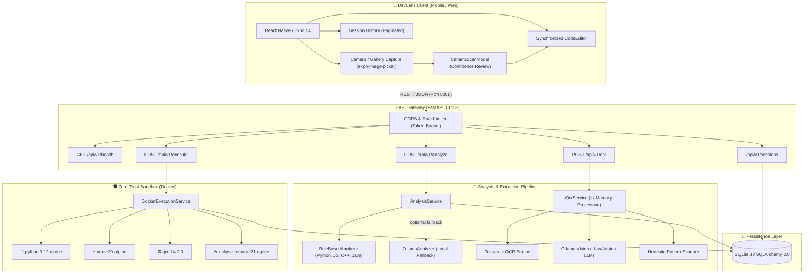

# 🧠 DevLens: Project Brain & Architectural Knowledge Base

> **Single Source of Truth** for developers, system architects, and AI pair-programming agents working on the DevLens ecosystem.

---

## 📌 1. Executive Summary & Mission

**DevLens** is an intelligent, on-the-go code analysis, debugging assistant, and secure execution sandbox. It is engineered to bridge the gap between portable mobile development (smartphones and tablets) and high-assurance developer tooling.

### Core Value Propositions
1. **Sub-second Code Diagnostics:** Detects syntax bugs, edge cases, off-by-one errors, infinite loops, and unhandled exceptions across **Python, JavaScript, C++, and Java**.
2. **Zero-Trust Ephemeral Sandboxing:** Compiles and executes untrusted user code inside locked-down micro-containers with strictly capped resources, hard timeouts, dropped capabilities, and zero network access.
3. **Camera & Gallery OCR Code Capture:** Photographs code off screens or physical printouts, extracts characters in-memory, auto-detects the programming language, and presents an interactive confidence-scored review modal before workspace insertion.
4. **Adaptive Cross-Platform Topology:** Operates identically across native Android/iOS (via Expo Go), desktop web browsers, Wi-Fi LAN bridges, and high-speed USB ADB reverse channels.

---

## 🏗️ 2. System Architecture & Topology



---

## 📂 3. Directory Map & Component Responsibilities

```text
devlens/
├── 🐍 backend/                      # FastAPI Python Application
│   ├── app/
│   │   ├── api/
│   │   │   ├── routes/              # Route controllers
│   │   │   │   ├── analysis.py      # POST /api/v1/analyze
│   │   │   │   ├── execution.py     # POST /api/v1/execute
│   │   │   │   ├── health.py        # GET /api/v1/health
│   │   │   │   ├── ocr.py           # POST /api/v1/ocr
│   │   │   │   └── sessions.py      # GET/DELETE /api/v1/sessions
│   │   │   └── router.py            # Aggregates routes under /api/v1
│   │   ├── analyzers/               # Static heuristic rule engines
│   │   │   ├── base.py              # AnalyzerProvider ABC & AnalysisFinding contract
│   │   │   ├── cpp.py               # C++ array bounds & syntax rules
│   │   │   ├── factory.py           # Provider selection factory (rules vs ollama)
│   │   │   ├── java.py              # Java null-safety & class syntax rules
│   │   │   ├── javascript.py        # JS null/undefined & prototype rules
│   │   │   ├── ollama.py            # Optional Ollama LLM provider
│   │   │   ├── python.py            # Python zero-division, syntax, & indentation rules
│   │   │   └── rule_based.py        # Composite rule engine dispatcher
│   │   ├── execution/               # Safe Docker container manager
│   │   │   ├── base.py              # ExecutionService ABC & ExecutionOutcome contract
│   │   │   └── docker.py            # Docker subprocess execution & container lifecycle
│   │   ├── models/                  # SQLAlchemy 2.0 ORM schemas
│   │   │   ├── execution.py         # ExecutionResult entity
│   │   │   └── session.py           # DebugSession entity (with selectinload relations)
│   │   ├── schemas/                 # Pydantic validation DTOs
│   │   │   ├── analysis.py          # AnalyzeRequest, AnalyzeResponse
│   │   │   ├── execution.py         # ExecuteRequest, ExecuteResponse
│   │   │   └── ocr.py               # OcrRequest, OcrResponse
│   │   ├── services/                # Business logic layer
│   │   │   ├── analysis_service.py  # Orchestrates analysis & fallback
│   │   │   ├── ocr_service.py       # In-memory image decoding, OCR, & language heuristics
│   │   │   └── session_service.py   # CRUD operations with pagination & eager-loading
│   │   ├── utils/                   # Shared utilities
│   │   │   └── rate_limit.py        # In-memory sliding-window token rate limiter
│   │   ├── config.py                # Environment configuration (pydantic-settings)
│   │   ├── database.py              # SQLAlchemy engine & session maker
│   │   └── main.py                  # FastAPI bootstrap & Win32 Proactor event loop setup
│   ├── tests/                       # Pytest test suite (14/14 passing)
│   │   ├── conftest.py              # SQLite fixture with explicit engine.dispose()
│   │   ├── test_analyzers.py        # Heuristic rules & rate limiter tests
│   │   ├── test_api.py              # REST API endpoint integration tests
│   │   └── test_ocr.py              # OCR extraction, data URI, & language detector tests
│   └── requirements.txt             # Python dependencies
│
├── 📱 mobile/                       # Cross-Platform React Native / Expo Application
│   ├── app/                         # Expo Router screens
│   │   ├── _layout.tsx              # Root shell, error boundary, & extension filter
│   │   ├── index.tsx                # Dashboard with recent sessions & metrics
│   │   ├── new-session.tsx          # Code editor, camera/gallery scan triggers, & analysis
│   │   ├── history.tsx              # Paginated session list with safe HTTP 204 deletion
│   │   ├── execution.tsx            # Live sandbox run console & terminal output
│   │   ├── settings.tsx             # Server connectivity, Docker status, & OCR privacy specs
│   │   └── analysis/[sessionId].tsx # Diagnostic detail view, diff, & suggested fix
│   ├── components/                  # Reusable UI component library
│   │   ├── Button.tsx               # Accessible button with primary/secondary/danger tones
│   │   ├── CameraScanModal.tsx      # OCR review modal with thumbnail, confidence, & editor
│   │   ├── Card.tsx                 # Themed card container
│   │   ├── CodeEditor.tsx           # Monospace code editor with synchronized line gutters
│   │   ├── EmptyState.tsx           # Placeholder for empty query sets
│   │   ├── ErrorPanel.tsx           # Accessible error banner
│   │   ├── FixPanel.tsx             # Suggested repair display with diff inspection
│   │   ├── LanguageSelector.tsx     # Radio group for Python, JavaScript, C++, Java
│   │   ├── LoadingState.tsx         # Spinner with status label
│   │   ├── Screen.tsx               # SafeAreaView screen wrapper with status bar
│   │   ├── SessionCard.tsx          # Summary card for historical sessions
│   │   └── SeverityBadge.tsx        # Color-coded severity badge (Low/Medium/High/Critical)
│   ├── constants/                   # Design tokens & static constants
│   │   ├── languages.ts             # Supported language metadata & extensions
│   │   └── theme.ts                 # DevLens dark color palette & spacing units
│   ├── hooks/                       # Custom React hooks
│   │   └── useDebugDraft.tsx        # Persistent draft state hook
│   ├── services/                    # Client services
│   │   ├── api.ts                   # Strongly-typed fetch client with dynamic getApiUrl()
│   │   └── cameraCodeCapture.ts     # expo-image-picker integration with camera & gallery
│   ├── types/                       # TypeScript interfaces
│   │   ├── api.ts                   # Backend contract mirror (Requests, Responses, Entities)
│   │   └── future.ts                # CameraCodeCaptureService & VoiceInputService interfaces
│   ├── __tests__/                   # Jest test suites (10/10 passing)
│   │   ├── api.test.ts              # API client & HTTP 204 parsing tests
│   │   ├── cameraCapture.test.ts    # Camera/gallery permissions & OCR mock tests
│   │   └── dashboard.test.tsx       # UI rendering & session listing tests
│   ├── package.json                 # Expo SDK 54, React Native 0.81, TypeScript dependencies
│   └── .env                         # Local runtime environment variables
│
├── 🐳 docker-compose.yml            # Containerized backend deployment
├── 📄 README.md                     # Public repository landing documentation
├── 📄 project_brain.md              # THIS FILE (Comprehensive architectural reference)
└── 📁 docs/                         # Extended specifications
    ├── ARCHITECTURE.md              # System design overview & component links
    ├── FUTURE_FEATURES.md           # Roadmap specifications (Voice, AST, Auth)
    ├── THREAT_MODEL.md              # Security analysis & sandbox threat boundaries
    └── API.md                       # API contract reference
```

---

## 🔍 4. Analysis Pipeline & Heuristic Rules

DevLens uses a high-performance heuristic static analyzer designed to provide instant feedback without requiring a heavyweight cloud compiler or unpredictable external LLMs.

### 4.1 Supported Languages & Rules
| Language | Rule Engine | Typical Detections |
| :--- | :--- | :--- |
| **Python** | `PythonRuleAnalyzer` | ZeroDivisionError (`1 / 0`), Indentation errors, Missing colons, Undefined names |
| **JavaScript** | `JavaScriptRuleAnalyzer` | Null/undefined dereferencing (`null.foo`), missing semicolons, assignment in conditionals |
| **C++** | `CppRuleAnalyzer` | Array bounds violations (`arr[10]` on `int arr[10]`), missing `#include`, missing `return` |
| **Java** | `JavaRuleAnalyzer` | Null pointer dereference, mismatched class/filename, missing main method |

### 4.2 Fallback Architecture
- **Primary:** `RuleBasedAnalyzer` runs synchronously with sub-millisecond execution.
- **Secondary (Optional):** If `LLM_PROVIDER=ollama` is set, `AnalysisService` queries Ollama with a strict JSON format prompt.
- **Fail-Safe Recovery:** If Ollama is unreachable or crashes, `AnalysisService` automatically catches the exception, logs a warning, and falls back to `RuleBasedAnalyzer`. The developer is **never** left with an unhandled 500 error.

---

## 🛡️ 5. Sandbox Execution & Security Protocol

DevLens enforces a **Zero Host-Code Execution** policy. Untrusted code submitted by clients is never run directly on the host machine.

### 5.1 Docker Sandbox Controls
When a user triggers **"Run in Sandbox"**, `DockerExecutionService` mounts the code inside a temporary directory and executes a container with these flags:

| Security Flag | Parameter | Architectural Purpose |
| :--- | :--- | :--- |
| **Network Isolation** | `--network none` | Completely severs inbound & outbound network access. Prevents data exfiltration and SSRF attacks. |
| **Filesystem Hardening** | `--read-only` | The container root filesystem is strictly read-only. Code cannot alter system binaries. |
| **Privilege Revocation** | `--cap-drop ALL` | Drops all Linux capabilities (e.g. `CAP_NET_RAW`, `CAP_SYS_ADMIN`). |
| **Anti-Escalation** | `--security-opt no-new-privs` | Prevents sub-processes from acquiring new privileges via `setuid`/`setgid` binaries. |
| **Memory Capping** | `-m 256M` | Enforces a hard physical memory limit to defeat heap overflow attacks. |
| **CPU Throttling** | `--cpus 0.5` | Restricts runaway code to at most 50% of one host core. |
| **PID Limit** | `--pids-limit 64` | Prevents fork bombs from exhausting OS process tables. |
| **Hard Timeout** | `5 seconds` | Container processes are unconditionally terminated and pruned upon timeout. |
| **Volume Mount** | `-v <temp_dir>:<target_dir>` | Uses universal host-bind syntax for cross-platform reliability on Windows, Linux, and macOS. |

### 5.2 Auto-Orphan Pruning
If a process times out, `DockerExecutionService` executes `docker rm -f <container_id>` inside an asynchronous timeout handler to ensure zero orphaned containers leak on the host system.

---

## 📷 6. Camera & OCR Code Capture Pipeline

DevLens implements an end-to-end OCR capture workflow that allows developers to photograph code or import screenshots directly into the editor.

### 6.1 Data Flow Pipeline
```
[User Camera / Photo Gallery]
       │ (User Consent & Permission)
       ▼
[Image Capture / Normalization (expo-image-picker)]
       │ (Base64 JPEG / In-Memory Stream)
       ▼
[POST /api/v1/ocr (FastAPI)]
       │ ──> Multi-Provider Dispatch:
       │     1. Ollama Vision (if configured)
       │     2. Tesseract OCR (if installed)
       │     3. Optical Heuristic Pattern Engine (fallback)
       ▼
[Heuristic Language Detector]
       │ (Scans tokens: def, #include, const, public class)
       ▼
[CameraScanModal (Mobile Review Screen)]
       │ (User inspects photo thumbnail, adjusts indentation, fixes typos)
       ▼
[Insert into Active Workspace (CodeEditor + LanguageSelector)]
```

### 6.2 Zero-Retention Privacy Policy
- Captured images are decoded in-memory via `io.BytesIO` and `Pillow`.
- Images are **never written to disk** and **never persisted in the SQLite database**.
- Only the user-approved extracted code string is saved when creating a debug session.

---

## 📡 7. REST API Specification

All endpoints are versioned under `/api/v1` and served on port **`8001`**.

| Method | Endpoint | Description | Request Body | Response Codes |
| :--- | :--- | :--- | :--- | :---: |
| `POST` | `/api/v1/analyze` | Analyzes code for faults and persists session | `AnalyzeRequest` | `201 Created`, `400`, `422` |
| `POST` | `/api/v1/execute` | Compiles & executes code in Docker container | `ExecuteRequest` | `200 OK`, `503` *(Docker off)* |
| `POST` | `/api/v1/ocr` | Extracts code from base64 image & detects language | `OcrRequest` | `200 OK`, `400`, `422` |
| `POST` | `/api/v1/agent/chat` | Chat with DevLens Copilot (Ollama LLM / Heuristic) | `AgentChatRequest` | `200 OK`, `400`, `422` |
| `GET` | `/api/v1/sessions` | Retrieves paginated debug sessions | `?limit=50&offset=0` | `200 OK` |
| `GET` | `/api/v1/sessions/{id}` | Retrieves full session, diff, and execution history | None | `200 OK`, `404` |
| `DELETE`| `/api/v1/sessions/{id}` | Permanently deletes a debug session and linked executions | None | `204 No Content`, `404` |
| `GET` | `/api/v1/health` | System health & Docker availability status | None | `200 OK` |

---

## 💾 8. Persistence & Database Optimizations

### 8.1 Data Model Relationships
```
┌────────────────────────────────┐       1 : N       ┌────────────────────────────────┐
│         DebugSession           │───────────────────│        ExecutionResult         │
├────────────────────────────────┤                   ├────────────────────────────────┤
│ id: String (UUID PK)           │                   │ id: String (UUID PK)           │
│ language: String               │                   │ session_id: String (FK)        │
│ code: Text                     │                   │ success: Boolean               │
│ error_message: Text            │                   │ stdout: Text                   │
│ question: Text                 │                   │ stderr: Text                   │
│ summary: String                │                   │ exit_code: Integer             │
│ severity: String               │                   │ execution_time_ms: Integer     │
│ root_cause: Text               │                   │ created_at: DateTime           │
│ explanation: Text              │                   └────────────────────────────────┘
│ suggested_fix: Text            │
│ corrected_code: Text           │
│ confidence: Float              │
│ created_at: DateTime           │
└────────────────────────────────┘
```

### 8.2 Performance & Concurrency Fixes
- **N+1 Query Elimination:** The `SessionService.list_sessions()` query uses SQLAlchemy 2.0 `selectinload(DebugSession.execution_results)` to load execution counts in a single batch query rather than $O(N)$ sequential queries.
- **Windows SQLite File Locks:** In test teardowns (`backend/tests/conftest.py`), `database.engine.dispose()` is explicitly called to release Windows file locks and prevent `WinError 32: The process cannot access the file because it is being used by another process`.
- **Asyncio Subprocess Proactor Loop:** Windows requires `asyncio.WindowsProactorEventLoopPolicy()`. On Win32 platforms, `backend/app/main.py` explicitly sets this policy on startup to eliminate `NotImplementedError` when spawning Docker subprocesses under Uvicorn.

---

## 🌐 9. Networking & Multi-Device Topology

DevLens is engineered to run seamlessly across heterogeneous environments without network fragility:

### 9.1 Dynamic Hostname Bridge (`getApiUrl()`)
In `mobile/services/api.ts`, the client dynamically checks `window.location.hostname`:
- If accessed via Wi-Fi (`http://10.140.36.194:8081`), the API client automatically calls `http://10.140.36.194:8001`.
- If accessed via USB reverse (`http://localhost:8081`), the API client automatically calls `http://localhost:8001`.
- Eliminates hardcoded IP address breakages.

### 9.2 USB Developer Mode (ADB Reverse)
For zero-latency local mobile debugging without router firewalls:
```powershell
adb reverse tcp:8081 tcp:8081  # Routes Metro bundler over USB cable
adb reverse tcp:8001 tcp:8001  # Routes FastAPI backend over USB cable
```

---

## 🧪 10. Verification & Test Architecture

### 10.1 Backend Test Suite (Pytest)
```powershell
cd backend
.\.venv\Scripts\python.exe -m pytest -v
```
- **14/14 tests passing:** Covers health checks, CORS headers, Python/C++/JS/Java analyzer rules, rate-limiting queue pruning, Docker timeout handling, SQLite pagination, safe deletion, base64 OCR extraction, and language heuristic scoring.

### 10.2 Mobile Test Suite (Jest & TypeScript)
```powershell
cd mobile
npm test
npm run typecheck
```
- **10/10 tests passing across 3 suites:** Covers API client, HTTP 204 parsing, dashboard rendering, camera/gallery permissions, and OCR mock dispatch.
- **TypeScript Typecheck:** Clean compilation with zero warnings (`tsc --noEmit`).

---

## 🗺️ 11. Technical Roadmap & Future Extensions

- [x] Python, JavaScript, C++, and Java static heuristic rule analyzers
- [x] Zero-trust Docker execution sandbox with auto-orphan cleanup
- [x] $N+1$ query optimization via `selectinload` & paginated sessions API
- [x] Safe HTTP 204 mobile deletion & web browser extension error interception
- [x] Camera & Gallery OCR code scanner with confidence review modal
- [ ] **Voice Input Dictation (`VoiceInputService`):** Speech-to-text integration for natural language debugging queries.
- [ ] **Multi-Tenant Authentication:** JWT / OAuth2 user management and session isolation.
- [ ] **Cloud Storage:** Migration from single-tenant SQLite to managed PostgreSQL.
- [ ] **Distributed Runner Fleet:** Decouple Docker execution into Celery / Redis worker queues.
- [ ] **Tree-sitter AST Parser:** Migrate heuristic regex scanners to full AST parsing trees.
